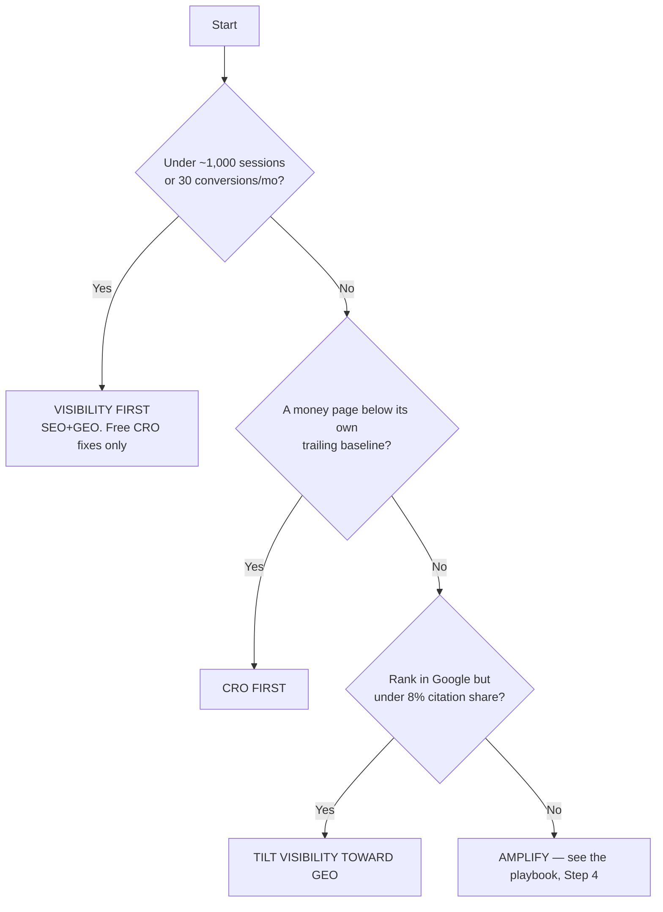

<!--
PRODUCTION NOTES (do not publish this block)

SCHEMA
- Schema: Article + FAQPage + BreadcrumbList. Author Person schema for Sunny Patel, sameAs -> LinkedIn.
- FAQPage: generated from front-matter faqs[] (4 pairs). Do NOT double-mark the visible FAQ section separately.
- Visible dateModified on page (author line). Refresh diary: January 2027, 15%+ substantive change.

ASSETS
- Decision tree is expressed TWICE below: as a numbered if/then list (primary, retrievable) and as a mermaid
  flowchart. Never ship this as image-only. If a raster is added later for social, its information must already
  live in the list.

DATA CONSISTENCY (locked upstream — do not restate differently)
- 8% median citation share = the informal 50-site pilot, owned by /research/citation-share-study/ and the pillar.
  >=30% = the "good" threshold. Keep both phrasings identical to the pillar and audit pages on every refresh.
  The pilot is a single median (n=50) — never imply segmentation, spread, or per-engine cuts here.
- Verdict must match the pillar FAQ ("Should I do SEO, GEO, or CRO first?"): CRO-relevant fixes first, then SEO+GEO
  together as one visibility effort. This page keeps that verdict FLAT. The ~1,000-session floor is framed as WHICH
  CRO (free fixes vs a paid testing programme), never as whether CRO comes first. Do not let the two extractable
  answers disagree.
- Payback windows keep the pillar's timeline table: fixes first-signal 1-4 weeks; new content/topical authority
  3-6 months; AI citations lag Google by ~1-2 months (our data — keep the attribution). Do not restate with
  different ranges.
- External benchmark: the Smart Insights / Contentsquare citation covers the ~2.5% global ecommerce average ONLY.
  The 2-5% B2B/lead-gen band is framed as "commonly quoted benchmarks" — do not pin it to that source.

ROUTING FLAG (not a content issue, matches audit + budget pages): this page uses /conversion/audit/,
/conversion/low-traffic-testing/, /technical/audit/, /measurement/ai-traffic/, /measurement/citation-monitoring/
as reader-facing paths to stay consistent with the pillar and the strategy cluster. The stack ADR
(/ops/stack-and-scaffold) maps collections to /cro/*, /technical/*, /measurement/*. Reconcile the redirect map
before launch so these links don't 404. /conversion/low-traffic-testing/ is a proposed slug (the topical map fixes
no Section-5 URLs) — confirm the /conversion/ prefix before launch. If any Section 2/3/5/7 destination isn't in
the launch batch, interim-point its link at the relevant pillar step rather than shipping a dead link.
Cross-page consistency wins until routing settles.

VERIFY GPTBot, ClaudeBot, PerplexityBot, Google-Extended access per bot policy. All content in initial HTML.
-->

# SEO vs GEO vs CRO: Where to Invest First on an Existing Site

**Fix your conversion leaks first, then fund SEO and GEO together as one visibility effort. That order holds for any live site with traffic worth working with. The one twist: under about 1,000 sessions a month, "fix conversion" means the free fixes — message clarity, forms, obvious friction — not a paid testing programme, because you don't have the traffic to test.** That's the answer. The rest of this page is the working, so you can check it against your own numbers.

Here's why you've never been given that answer straight. Everyone who sells you SEO also sells you GEO and CRO, and a shop that sells three things will always tell you to buy three things. Ranking them honestly means admitting one invoice should shrink this quarter, and nobody writes the page that shrinks their own invoice. We're not billing you for the tie, so we can rank them. This is the ranking.

> **TL;DR**
> - [The decision rule](#the-decision-rule-three-questions-one-answer) — three questions, one lane.
> - [What each discipline pays back, and when](#what-each-discipline-pays-back-and-when) — the core comparison.
> - [The four site states](#the-four-site-states-find-yours-get-your-order) — find yours, get your order.

---

## The Decision Rule: Three Questions, One Answer

Answer three questions in order and stop at the first one that routes you. This is the whole method; everything below is the evidence for it.

1. **Under about 1,000 sessions or 30 conversions a month?** → **Visibility first (SEO+GEO), free CRO fixes only.** You can't run an honest A/B test at this volume, so paid CRO is astrology. Fix the obvious leaks by judgement, then put the real money into being found.
2. **Traffic's fine, but a money page converts below its own trailing 90-day baseline?** (No baseline yet? Use the sanity band under the tree.) → **CRO first.** You already have the visitors. The cheapest revenue on the site is the visits you're currently wasting.
3. **Ranking in Google but sitting under an 8% AI-citation share?** → **Tilt the visibility budget toward GEO.** You've earned the search trust; you're just not being retrieved into the answers. That's a lean, not a separate project.

Clear all three and you're not in an investment decision anymore — you're in an amplification one. That's a different page (the [website marketing playbook](/how-to-market-a-website/), Step 4).

Notice question 2 doesn't hand you a universal conversion-rate floor, because there isn't one. Your own trailing baseline is the honest test. If you've got no baseline yet, use a coarse public band as a sanity check: the global average ecommerce conversion rate sits around **2.5%** ([Smart Insights / Contentsquare, 2025](https://www.smartinsights.com/ecommerce/ecommerce-analytics/ecommerce-conversion-rates/)), most ecommerce sites land in the 2–3% range, and commonly quoted B2B and SaaS lead-gen benchmarks run 2–5% depending on deal size. Sitting well under your band with real traffic on the page is a leak. Precise, situation-keyed ratios live at **[website marketing budget](/strategy/budget/)** — this page decides the *lane*, that one decides the *spend*.

---

## Why "Do All Three" Is a Pricing Strategy, Not Advice

"Do all three" is what an agency says when every answer maps to a line item. It isn't dishonest, exactly — it's structural. A vendor selling an SEO retainer, a GEO/AEO retainer and a CRO programme cannot rank them, because ranking them means telling you one of their invoices should be smaller this quarter. So the answer defaults to the one that keeps all three lines live: buy all three, start now, with us.

The tell is the second retainer. SEO and [GEO](/glossary/geo/) are one discipline sharing roughly 80% of their inputs — quality content, a crawlable and rendered site, clear structure, entity strength, structured data. Selling them as two line items is billing you twice for the same work. The 20% that genuinely differs — entity clarity, self-contained chunk-level answers in the [AEO](/glossary/aeo/) mould, optimising to be cited rather than clicked — is a lean you add to work you're already doing, not a team you hire. Anyone quoting you a separate "GEO retainer" next to an "SEO retainer" just handed you your reason to say no.

So the honest version has an order, and the order has conditions. Below is the order.

---

## What Each Discipline Pays Back, and When

Here's the table the three-retainer pitch can't show you, because the last column is the one that says "not yet." Rank by payback speed and prerequisite, and the sequence writes itself: CRO pays back in weeks and needs only traffic you already have; SEO and GEO compound for years but make you wait a quarter or two, and GEO waits on SEO landing first.

| Discipline | Prerequisite | First 90 days | First signal | Payback window | Compounds? | Wrong first pick when… |
|---|---|---|---|---|---|---|
| **CRO** | ~1,000 sessions + 30 conversions/mo to *test*; any traffic to *fix* | Fix the five money pages; test only if volume allows | 1–4 weeks | 2–6 weeks | No — banks the gain, holds it | You have almost no traffic to convert |
| **SEO** | Content and a crawlable site | Prune, refresh, expand from what you already rank for | 3–6 months | 3–6 months, then builds | Yes — indefinitely | Your funnel leaks; you'd rank into a bucket with a hole |
| **GEO** | You already rank in Google | Add entity clarity + chunk-level answers to the same pages | 2–4 months | Lags Google by ~1–2 months (our data) | Yes — with your search trust | You don't rank yet — there's nothing for engines to retrieve |

Two things this table settles. First, CRO doesn't compound and that's *why* it goes first: it banks a permanent lift on every visit fast, funding the slow-burn work behind it. Second, GEO is never the standalone first move — engines mostly cite what already earns trust in search, so GEO without SEO underneath is a citation you haven't earned yet. You tilt toward it; you don't lead with it.

### The math CRO wins on

The reason conversion goes first isn't taste, it's arithmetic. Take a site at 10,000 visits a month and a 1% conversion rate. Watch what each lever does.

| Move | New CVR | New traffic | Conversions/mo | Vs. today | When |
|---|---|---|---|---|---|
| Do nothing | 1% | 10,000 | 100 | — | — |
| **CRO: lift 1% → 2%** | 2% | 10,000 | 200 | **+100%** | Weeks |
| SEO: +50% traffic | 1% | 15,000 | 150 | +50% | Months |

Doubling a poor conversion rate doubles revenue in weeks. Growing traffic 50% — which is a real quarter's work — gets you half that, and it arrives months later. That's the entire case for fixing the bucket before you pour more water in. It's also why amplifying a leaky site is paying to lose faster: you're funding the traffic lever while the conversion lever sits at 1%.

---

## The Four Site States: Find Yours, Get Your Order

Every existing site is in one of four states. Find yours, take the verdict, ignore the rest for 90 days.

| State | The numeric gate | Invest first | Your first 90 days | What to ignore for now |
|---|---|---|---|---|
| **Leaky** | ≥1,000 sessions, a money page below its baseline | **CRO** | Fix the five money pages, test the top one | New content, PR |
| **Thin** | <1,000 sessions/mo | **SEO + GEO** | Publish and expand from what already ranks | Paid CRO testing, paid ads |
| **Invisible-to-AI** | Ranks in Google, <8% citation share | **GEO-tilted visibility** | Add entity clarity + chunk answers | A separate GEO retainer |
| **Healthy** | All three gates cleared | **Amplify** | Distribution, email, digital PR | More optimising — stop |

**Leaky.** You have the traffic and it's converting below its own trailing baseline. Don't buy a single new visitor. The cheapest revenue on your site is the visits you're already wasting, and CRO banks that lift in weeks. Fix the five money pages, then A/B test the highest-traffic one. Start at the **CRO audit**<!-- relink: /conversion/audit/ -->.

**Thin.** Under 1,000 sessions a month, testing is guesswork — two dozen conversions split two ways prove nothing. So "CRO" here means the free fixes only: rewrite the fuzzy headline, cut the dead form fields, unblock the checkout. Then put the real budget into visibility, because your bottleneck is that too few people ever arrive. Begin with **[GEO for established websites](/visibility/geo/)** and a **content audit**<!-- relink: /content/audit/ -->.

**Invisible-to-AI.** You rank in Google but sit under the 8% citation share we found as the median across 50 established sites — you've earned the search trust, you're just not being retrieved into AI answers. This isn't a new project; it's tilting your existing visibility work toward entity clarity and self-contained answers. Set up **citation monitoring**<!-- relink: /measurement/citation-monitoring/ --> so you can see the number move, then work the GEO lean into your pages.

**Healthy.** All three gates cleared: traffic converts, the site's cited, the content inventory's clean. Stop optimising and start amplifying — digital PR, email, repurposing, the mentions LLMs learn from. That's Step 4 of the **[website marketing playbook](/how-to-market-a-website/)**, and it's the only state where spending on reach isn't a subsidy for a broken funnel.

---

## How to Diagnose Your State in 5 Minutes

You need six numbers and a citation-share figure to place yourself: organic clicks, AI referrals, citation share, conversion rate by template, indexed-vs-valuable pages, and revenue per visit. Getting them is a solved problem — the **[90-minute website marketing audit](/strategy/audit/)** owns the how, down to which GSC menu, and the 20-prompt shortcut for citation share lives there too. There's no reason to re-teach it here.

What's unique to *this* page is the mapping: once you have the numbers, they drop straight into a lane.

| If your numbers say… | You're in state… | Go to |
|---|---|---|
| Traffic ≥1,000/mo, a money page under its baseline | Leaky | CRO |
| Traffic <1,000/mo | Thin | SEO + GEO |
| Rankings present, citation share <8% | Invisible-to-AI | GEO-tilt |
| All clear | Healthy | Amplify |

If your AI referrals look like zero, don't trust that they are — a chunk of AI-driven traffic arrives with no referrer. Confirm the real floor with **AI traffic tracking**<!-- relink: /measurement/ai-traffic/ --> before you decide visibility isn't your problem.

---

## When the Order Flips

Three situations override the default. Each is rare, each is decisive, and you'll know it when you see it.

**A checkout or signup that's actually broken → CRO first, at any traffic level.** A dead payment step or a signup that 500s isn't a test, it's a fire. You don't need statistical significance to fix a page that converts zero. Fix it today, whatever your session count. Where the fires hide: **CRO audit**<!-- relink: /conversion/audit/ -->.

**Low-traffic B2B with long sales cycles → messaging CRO, never A/B testing.** If you sell six-figure deals to 30 buyers a quarter, you will never reach test significance, and waiting for it wastes the year. Fix conversion by judgement and positioning, not experiments. The playbook for exactly this is **A/B testing on low-traffic sites: what to do instead**<!-- relink: /conversion/low-traffic-testing/ -->.

**A manual action or a rendering failure → technical first, above all three.** If Google's slapped you with a penalty, or your content only renders after JavaScript so crawlers and LLMs see a blank page, none of SEO, GEO or CRO can help — they're all downstream of a site that can't be read. Clear the blockage first: **technical SEO audit**<!-- relink: /technical/audit/ -->. What isn't in the initial HTML doesn't exist.

---

## FAQ

**Should SEO and GEO have separate budgets?**
No. SEO and GEO share about 80% of their inputs — the same content, the same crawlable site, the same entity work. Two retainers means paying twice for one job. Keep them on a single visibility line and fold the 20% that differs (entity clarity, chunk-level answers, citations over clicks) into work you're already doing.

**Can you do CRO on a low-traffic site?**
Yes — the free fixes, not the split tests. Under about 1,000 sessions and 30 conversions a month you can't run a statistically honest A/B test, so you fix the obvious leaks by judgement: message clarity, form fields, checkout friction. Save the testing programme for when the traffic can actually prove a winner.

**Is GEO worth doing before SEO?**
No — they're the same work, so you tilt, you don't sequence. SEO and GEO share roughly 80% of their inputs. You do the shared work once, then tip the 20% toward citations if you rank in Google but sit under an 8% AI-citation share. There's no separate GEO project to run first.

**How much should I spend on SEO vs GEO vs CRO?**
Allocate by your site's stage, not by splitting a pie three ways. A leaking site pours most of its budget into fixes; a site that holds water funds content and visibility. The stage-keyed ratios — with worked examples — live on the **[website marketing budget](/strategy/budget/)** page. Pick one lane for 90 days, then re-check.

---

## Pick One Lane

Don't split your quarter three ways at 33% each — that's how all three move slowly and none of them proves anything. Run the **[90-minute audit](/strategy/audit/)**, find your state, and commit one lane for 90 days. Then map the full sequence across the year with the **[plan template](/strategy/plan-template/)** and re-run the rule. The order is the strategy. Pick the lane.

*Written by Sunny Patel — in SEO since 2010, specialising in topical authority and entity SEO. Last updated 23 July 2026.*