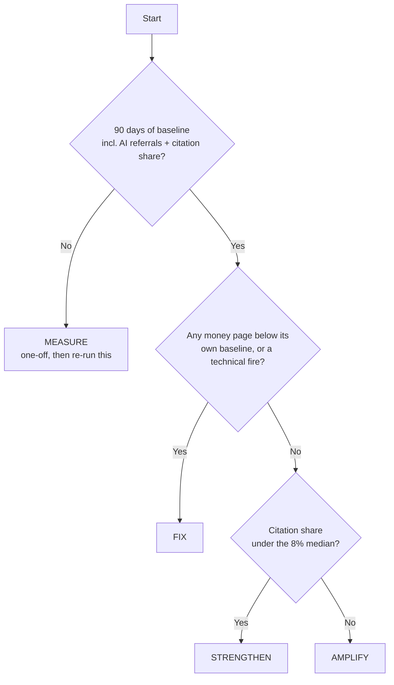

<!--
PRODUCTION NOTES (do not publish this block)

SCHEMA
- Schema: Article + FAQPage + BreadcrumbList. Author Person schema for Sunny Patel, sameAs -> LinkedIn.
- FAQPage: generated from front-matter faqs[] (4 pairs). Do NOT double-mark the visible FAQ section separately.
- Visible dateModified on page (author line). Refresh diary: January 2027, 15%+ substantive change.

LEAD ASSET (ungated)
- The "Copy This: The Fill-In Budget Table" below IS the downloadable, expressed in-medium. Ship a Google Sheet that
  mirrors it exactly (one tab: Stage rows x Measurement/Fix/Strengthen/Amplify columns, a Total Budget input cell, and
  =Total*ratio formulas per bucket). Copy-to-own (File > Make a copy), UNGATED. Wire the CTA to /budget-template/ ->
  302 -> the Sheet copy URL so the Sheet can rotate without a page edit. Do NOT hard-link the raw Google URL in body
  copy. Email capture is a soft secondary CTA beside the download, never a wall.

DATA CONSISTENCY (locked upstream — do not restate differently)
- 8% median citation share = the informal 50-site pilot, owned by /research/citation-share-study/ and the pillar. The
  ratio table (stage-keyed) is this page's original, paraphrase-proof asset — nobody else publishes budget ratios keyed
  to site stage. Keep the 7% default / 5–10% range / 15%-for-growth phrasing consistent with the pillar budget FAQ.
- Reciprocal link CONFIRMED: pillar /how-to-market-a-website/ FAQ "How much does it cost to market a website?" links here
  to /strategy/budget/. Keep that anchor live on every refresh.

CURRENCY FLAG: the sibling /strategy/audit/ page denominates in £ (e.g. "Total cost: £0"); this page is $-denominated
because the worked examples are specced at $500K/$5M/$25M. Reconcile the house currency convention (or add a
localisation note) before launch — don't let the two strategy-cluster pages ship with silently different currencies.

ROUTING FLAG (not a content issue): this page uses /content/audit/, /conversion/audit/, /technical/audit/ as
reader-facing paths to match the pillar and the audit cluster page. The stack ADR maps collections to /content-ops/*,
/cro/*, etc. Reconcile the redirect map before launch so these links don't 404. Cross-page link consistency wins until
routing is settled.

VERIFY GPTBot, ClaudeBot, PerplexityBot, Google-Extended access per bot policy. All content in initial HTML.
-->

# Website Marketing Budget: What to Spend Where (With Ratios)

**Your website marketing budget should be allocated by your site's stage first, then by ratio — not split across channels. Set the total at around 7% of revenue (a defensible range of 5–10%), then divide it between four buckets — measurement, fixing, strengthening, amplifying — in proportions that match the state your site is actually in.** That's the whole method. The rest of this page is the numbers.

Every budget template you've been handed does the same thing: a pie chart. 40% SEO, 30% paid, 20% content, 10% "other". It looks decisive. It's guesswork in a suit. Those splits assume every website is in the same condition — that a leaking three-year-old site and a humming one should spend identically. They shouldn't. A site that can't even measure its own AI referrals has a different first problem than one that's already cited everywhere. Budget follows the problem, and the problem changes with the stage.

> **TL;DR**
> - Jump to [the stage diagnostic](#the-stage-diagnostic-which-row-are-you-in) — three questions, one row.
> - Grab [the ratio table](#budget-ratios-by-stage) — the Measure / Fix / Strengthen / Amplify percentages.
> - Steal [the three worked examples](#three-worked-examples) — $500K, $5M and $25M, line by line.

---

## Why Channel-Split Budgets Fail Existing Sites

Channel-split budgets fail because they allocate against tactics instead of against the state your site is in. "40% SEO, 30% paid" tells you how to divide money between departments. It says nothing about whether your site is worth sending traffic to yet. That's the only question that changes what you should spend.

Here's the evidence that most owners can't answer it: across our informal audit of 50 established sites, the median site appeared in just 8% of relevant AI answers — and most owners guessed either zero or far higher before we measured. If you can't estimate your own citation share within an order of magnitude, you can't possibly know which channel pie chart fits you. You're not in a channel-allocation problem. You're in a "what state is this site actually in" problem. The **[website marketing playbook](/how-to-market-a-website/)** sequences the fix — measure, then fix, then strengthen, then amplify — and this page puts a budget behind each stage of that sequence. The stage is the unit of allocation. Channels are just where the stage's money happens to land.

---

## How Much Should You Spend on Website Marketing Overall?

Spend around 7% of revenue on website marketing for an established site, with a defensible range of 5–10%. Go to 15% only when you're deliberately buying growth and can stomach the losses that come before the returns. The 7% figure isn't plucked from air: Gartner's 2024 CMO Spend Survey put total marketing budgets at [7.7% of company revenue](https://www.gartner.com/en/newsroom/press-releases/2024-05-13-gartner-cmo-survey-reveals-marketing-budgets-have-dropped-to-seven-point-seven-percent-of-overall-company-revenue-in-2024), and the SBA's long-standing rule of thumb is [7–8% for firms under $5M](https://www.commonmind.com/blog/small-business-marketing-budget). Website marketing is the digital slice of that — for a site-first business, it's most of it.

What actually counts as budget matters more than the headline number, because "free" labour is why budgets lie. Here's the line:

| In the budget | Not in the budget |
|---|---|
| In-house marketing salaries (fully loaded) | Site rebuilds and replatforms (that's capex) |
| Freelancers and contractors | Brand advertising not tied to the site (TV, OOH, sponsorships) |
| Martech and tools | Product development |
| Paid media | Sales team compensation |
| Founder / operator time, priced at **$100/hr** | One-off design, logo, or rebrand work |
| Agency retainers for any of the above | Marketplace and transaction fees; prospecting performance-media beyond the website-marketing slice |

The founder-time line is the one everyone skips, and it's the one that breaks the maths. If you build the plan on "I'll just do the content myself" and never price your own hours, you'll under-resource everything and wonder why nothing shipped. Put your time in at $100/hr. It'll change what you choose to do yourself.

**Q: Is 7% too much for a small business?**
No — 7% is the floor for a business that wants its website to earn more next year than this year, not the ceiling. The exception runs the other way: if your margins are thin (under 10%) or you're in survival mode, drop to 5% and pour every point into the Fix stage, where the payback is fastest. 7% assumes growth is the goal. If it's just to keep the lights on, spend less, but spend it all on fixing.

---

## The Stage Diagnostic: Which Row Are You In?

Your stage is decided by three yes/no questions, answered in order. Stop at the first one that routes you.

1. **Do you have 90 days of baseline numbers, including AI referrals and citation share?** If **no** → you're in **Measure**. You can't allocate against a site you haven't measured.
2. **Does any of your five money pages convert below its own trailing 90-day baseline, or does the technical audit flag a crawl, render, or index fire?** If **yes** → you're in **Fix**. Something is leaking; plug it before you spend on anything else.
3. **Is your citation share still under the 8% median?** If **yes** → you're in **Strengthen**. The site holds water but isn't worth citing yet.

**No question routed you?** You're in **Amplify**. Now, and only now, buy reach.



Run the questions honestly and you'll land on exactly one row. To do them properly you need the numbers first: the **[90-minute website marketing audit](/strategy/audit/)** gives you the baseline and the money-page check, the **technical SEO audit**<!-- relink: /technical/audit/ --> surfaces the fires, and the **CRO audit**<!-- relink: /conversion/audit/ --> tells you which money pages leak. Do the audit, then pick your row.

---

## Budget Ratios by Stage

Here's the asset nobody else publishes: budget ratios keyed to your site's stage, not to channels.

| Your stage | Measurement ² | Fix | Strengthen | Amplify |
|---|---|---|---|---|
| **Measure** *(one-off)* | 100% ¹ | — | — | — |
| **Fix** | 10% | 55% | 25% | 10% ³ |
| **Strengthen** | 10% | 15% | 55% | 20% |
| **Amplify** | 10% | 10% | 35% | 45% |

*¹ Measure isn't a monthly row — nobody stays in it. It's a single month-one spend, capped at 5% of your annual budget, that buys your baseline (the six numbers, the 20-prompt citation audit, an analytics fix). The "100%" means: while you're in Measure, all of that one-off goes to measurement. Then you re-run the diagnostic and land on Fix, Strengthen, or Amplify.*

*² Measurement is a fixed 10% in every ongoing row. It is never the first thing you cut — it's the line that tells you whether the other 90% worked. Cut it and you're flying blind on purpose.*

*³ The 10% Amplify bucket in the Fix row is owned-channel maintenance only — emailing the list you already have, keeping earned mentions warm. Zero net-new paid acquisition goes to a site that still leaks; that's the subsidy-for-a-broken-funnel mistake the playbook warns about. Paid scales in Amplify, once the funnel is proven.*

What the fixed 10% measurement line actually buys: **AI traffic tracking**<!-- relink: /measurement/ai-traffic/ --> so you can see the referrals GA4 undercounts, and **citation monitoring**<!-- relink: /measurement/citation-monitoring/ --> so your citation-share number stays honest quarter to quarter. Those two are how you know when to change rows.

---

## Three Worked Examples

Three sites, three stages, three budgets. Same 7% of revenue, wildly different splits — because the stage, not the revenue, decides the shape.

### $500K Services Firm, Fix Stage — $2,900/mo

A solo operator with a three-year-old site that leaks. Founder does the thinking; freelancers do the specialist work; tools stay under $300/mo; zero paid media.

| Line item | $/mo | Stage bucket | Cash or time | Note |
|---|---|---|---|---|
| Analytics + AI-monitor (lite) tools | 140 | Measurement | Cash | GSC + GA4 free; small AI-referral tool on top |
| Measurement review | 150 | Measurement | Time (1.5 hrs) | Founder, monthly |
| Freelance developer | 700 | Fix | Cash | Technical debt + render/crawl fixes |
| Money-page CRO copy + oversight | 800 | Fix | Time (8 hrs) | Founder rewriting the five money pages |
| Fix-stage misc tooling | 95 | Fix | Cash | Heatmap / form analytics |
| Freelance writer | 500 | Strengthen | Cash | One refresh or new piece |
| Content editing / direction | 200 | Strengthen | Time (2 hrs) | Founder |
| Content tool | 25 | Strengthen | Cash | — |
| Email platform | 40 | Amplify | Cash | Existing list only |
| Emailing the list | 250 | Amplify | Time (2.5 hrs) | Owned channel; no paid |
| **Total** | **2,900** | — | — | **$1,500 cash / $1,400 imputed time** |

Read the bottom line twice. Half of this "budget" is founder time, not cash out the door — $1,500 leaves the bank, $1,400 is the founder's own hours priced at $100. That's not a trick; it's the honest cost. Ignore the imputed half and you'll wildly over-commit your own week. *What changes the row: once all five money pages clear their leaks and the technical audit passes, this firm moves to Strengthen — Fix drops from 55% to 15%, freeing roughly $1,160/mo to point at content.*

### $5M SaaS, Strengthen Stage — $29,000/mo

The site holds water. One in-house marketer runs the show, content contractors supply the volume, and — critically — SEO and GEO sit on **one** line, not two.

| Line item | $/mo | Stage bucket | Note |
|---|---|---|---|
| Measurement stack (rank + AI citation + analytics) | 1,900 | Measurement | Tools |
| In-house marketer (measurement share) | 1,000 | Measurement | Loaded salary, allocated |
| Technical contractor | 3,850 | Fix | Ongoing technical debt |
| In-house marketer (fix share) | 500 | Fix | Loaded salary, allocated |
| Content contractors (writers + editors) | 8,000 | Strengthen | 3–4 pieces + refreshes |
| In-house marketer (content-ops share) | 5,000 | Strengthen | Loaded salary, allocated |
| **SEO + GEO (one combined line)** | 2,500 | Strengthen | One retainer, not two — this is the 80% shared work |
| Strengthen tooling | 450 | Strengthen | — |
| Digital PR contractor | 4,000 | Amplify | Earning mentions LLMs read |
| Email + distribution tools | 800 | Amplify | — |
| In-house marketer (amplify share) | 1,000 | Amplify | Loaded salary, allocated |
| **Total** | **29,000** | — | Content ops is the 55% that defines this stage |

Notice the single SEO + GEO line. If an agency proposal in front of you has separate "SEO retainer" and "GEO/AEO retainer" rows, that's your scripted no: they share about 80% of their inputs, so you're being billed twice for one job. *What changes the row: when citation share beats the 8% median and the topical map is over 70% published, Fix drops to 10% and Amplify rises to 45% — the SaaS moves to Amplify.*

### $25M Ecommerce, Amplify Stage — $145,000/mo

The site converts, it's cited, the content inventory is clean. Now the money goes to reach: digital PR, email, and retargeting at 45%; content maintains at 35%.

| Line item | $/mo | Stage bucket | Note |
|---|---|---|---|
| Analytics + attribution + AI citation stack + analyst | 14,500 | Measurement | The fixed 10%, at scale |
| CRO team + testing programme | 10,000 | Fix | Keeping the funnel tight |
| Technical / dev | 4,500 | Fix | Maintenance, not rescue |
| Content team (in-house + contractors) | 35,000 | Strengthen | Maintaining a large inventory |
| SEO + GEO (one combined line) | 12,000 | Strengthen | Still one line |
| Strengthen tooling | 3,750 | Strengthen | — |
| Digital PR team | 30,000 | Amplify | Mentions across sources LLMs retrieve |
| Email + CRM programme | 15,000 | Amplify | The channel AI can't intercept |
| Retargeting + paid to warm audiences | 20,250 | Amplify | Warm only — proven funnel |
| **Total** | **145,000** | — | — |

One caveat that keeps this table credible: the $65,250 Amplify bucket is the *website-marketing* distribution slice — brand PR, email, and retargeting that compound your owned visibility. It is **not** an ecommerce operator's full performance-media or blended-CAC budget. Prospecting paid, marketplace fees, and channel scaling live outside this 7% line — that's a separate discipline with its own budget. Don't read ~3% of revenue on distribution as "all the paid an ecommerce site runs." It isn't. Build the distribution engine here: **digital PR**<!-- relink: /distribution/digital-pr/ --> and the **email moat**<!-- relink: /distribution/email-moat/ -->, fed by a clean **content inventory**<!-- relink: /content/audit/ -->. *What changes the row: a new money-page leak or a failed technical audit snaps it straight back to Fix — even a $25M site amplifying a leak is a subsidy for a broken funnel.*

---

## When to Change Rows: Stage-Shift Triggers

You change rows when you hit the exit criteria, not when the quarter turns over. Each transition has a hard test.

| From → To | The hard test |
|---|---|
| Measure → a real row | 90 days of baseline captured, including AI referrals and citation share → re-run the diagnostic and adopt the row it gives you |
| Fix → Strengthen | All five money-page leaks patched (each converting at or above its trailing baseline) **and** the technical audit passes — no crawl, render, or index fires |
| Strengthen → Amplify | Citation share beats the 8% median **and** the topical map is over 70% published |
| Amplify → Fix (regression) | A new money-page leak or a failed technical audit — drop back and fix before you spend another dollar on reach |

The regression row is the one people forget. Stages aren't a ladder you climb once; a site in Amplify that springs a leak belongs back in Fix that week. Map the whole sequence across a year with the **[quarter-by-quarter sequencing](/strategy/plan-template/)** template, and if you're still deciding what to fund first, **[SEO vs GEO vs CRO](/strategy/seo-vs-geo-vs-cro/)** settles the order.

---

## Budget Mistakes That Waste the Most Money

Five mistakes waste more budget than all the others combined. Every one is an allocation error.

1. **Paying separate SEO and GEO retainers** — billed twice for work that's 80% identical. One visibility line, always.
2. **Cutting measurement first** — the moment you're under pressure, the 10% that proves the other 90% worked is the first thing owners kill. Backwards. It's the last.
3. **Amplifying while in Fix** — buying traffic for a funnel that leaks. You pay full price to lose faster.
4. **Buying tools before people** — a $300 stack doesn't write the content or fix the page. Tools are the smallest line for a reason.
5. **Pricing founder time at zero** — the line that makes every budget lie. Unpriced hours are why plans over-commit and nothing ships.

---

## Copy This: The Fill-In Budget Table

Ungated, no email required. It's the ratio table turned on its side — buckets as rows, so you can fill in a single dollar column for your stage. Drop your annual revenue in, take 7% (or your chosen 5–10%), then apply your row's percentages.

```
WEBSITE MARKETING BUDGET — [your site]
Annual revenue:            $__________
Budget rate (5–10%):        ____%   → Annual budget: $__________  → Monthly: $__________

Your stage (from the diagnostic): [ Measure / Fix / Strengthen / Amplify ]

MONTHLY SPLIT           Fix row   Strengthen row   Amplify row   → Your $/mo
  Measurement            10%          10%             10%          $________
  Fix                    55%          15%             10%          $________
  Strengthen             25%          55%             35%          $________
  Amplify                10%*         20%             45%          $________
                        -----        -----           -----
  Total                  100%         100%            100%         $________

* Fix-row Amplify = owned channels only (email your existing list). Zero paid acquisition.
  Measure stage = one-off, month one, capped at 5% of the annual budget, then re-run the diagnostic.
```

---

## FAQ

**How much does it cost to market a website?**
Budget around 7% of revenue as a working default, with a defensible range of 5–10%. On $500K revenue that's roughly $2,900 a month; on $5M, about $29,000; on $25M, about $145,000. The split matters more than the total — allocate by your site's stage (Measure, Fix, Strengthen, Amplify), not by channel.

**What percentage of revenue should go to website marketing?**
7% is the working default for an established site, with a defensible range of 5–10%. Gartner puts total marketing at 7.7% of revenue; the SBA's rule of thumb is 7–8% for firms under $5M. Push to 15% only when you're deliberately buying growth and can fund the losses that come first.

**Should SEO and GEO be separate budget lines?**
No. SEO and GEO share about 80% of their inputs — the same content, the same crawlable site, the same entity work. Two retainers means paying twice for one job. Keep them as a single visibility line and fold the 20% that differs (entity clarity, chunk-level answers) into work you're already doing.

**Is paid advertising worth it for an existing website?**
Yes, if the site has passed the Fix stage. Paid multiplies a funnel that already converts and retargets warm traffic you've earned. On a leaking site it's a subsidy for a broken funnel — you pay full price to lose faster. Fix your five money pages first, then scale paid.

---

Don't pick a row from memory — you'll pick the flattering one. Run the **[90-minute website marketing audit](/strategy/audit/)** first, get your six numbers and your citation share, then let the diagnostic tell you which row you're in. Adopt it, copy the table above, and spend against the site you actually have.

*Written by Sunny Patel — in SEO since 2010, specialising in topical authority and entity SEO. Last updated 23 July 2026.*