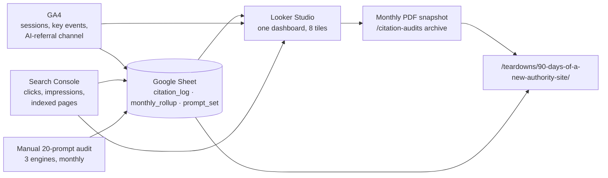

<!--
NOT FOR PUBLICATION. INTERNAL MEASUREMENT SPEC + AUDIT PROTOCOL.
- Lives under /ops/* — noindex, robots-disallowed (Disallow: /ops/), sitemap-excluded per the stack ADR
  (content/ops/stack-and-scaffold.md). Not a citation target.
- Companion deliverables (SEPARATE artifacts, NOT shipped inside this .md):
    A. Google Sheet template — 3 tabs (citation_log, monthly_rollup, prompt_set). Schemas defined in §6.
    B. Prompt-set v1 — 20 rows. Locked list in §5. When built, tab B of the Sheet is the source of truth;
       §5 is the human-readable copy and must be kept in sync with it.
  Neither exists yet. This spec defines them; building them is two follow-on tasks, not free output.
- Named-claims register (must stay consistent with content/pillars/how-to-market-a-website.md):
    £0 tooling at launch; 3 GA4 key events max; 20 prompts × 3 scored engines = 60 checks/month;
    90-minute audit ceiling; citation share = prompts-cited-with-a-link ÷ completed checks
    (60 when the full grid runs — pillar definition); 8% median benchmark (pillar #1, 50-site audit);
    targets 0%→8% by day 90, 15% by day 180, ≥30% = "good" long-run (pillar bar);
    <4 hrs/month total ops; Perplexity-cites-first prediction;
    AI-referral counts are a floor, never a total.
- RECONCILIATION NOTE (why this differs from an earlier draft): the pillar defines the DIY audit as
  three engines and citation share as "% of relevant prompts cited". This spec IS that DIY method run
  on ourselves, so it inherits both. The 4-engine / weighted points-÷-160 variant was dropped to keep
  the two docs' numbers comparable. The separate 4-engine research study (/research/citation-share-study/)
  is a different instrument and is out of scope here.
- ADR AMENDMENT NOTE: the stack ADR's release gate #2 ("0 KB JS on article routes, island count = 0
  on content pages", stack-and-scaffold.md §6) is amended by §1 of this spec: content routes still ship
  zero islands and no bundled .js; the sole permitted script is the inline consent loader (< 1 KB,
  no external request pre-consent). The ADR delegated the analytics decision here ("No analytics
  decision here — owned by the Measurement section deliverable"), so this doc is where the amendment
  is recorded. Mirror it as a comment next to the ADR gate when convenient.
- SLUG NOTES: /technical/bots/ is the real AI-crawler-policy slug (per topical map + existing content);
  the earlier /technical/ai-crawlers placeholder does not exist and is not used. Internal links use
  the pillar's trailing-slash convention throughout.
-->

# Measurement & Citation Monitoring: Internal Setup Spec (v1)

Everything site.marketing tracks from day zero, how it's configured, and the monthly citation-audit protocol. **If a number isn't defined in this doc, we don't report it.** This spec is binding: if a metric definition, threshold, or prompt changes, it changes here first and the dashboard, the Sheet, and any published derivative follow.

| Field | Value |
|---|---|
| **Status** | Accepted |
| **Date** | 2026-07-23 |
| **Owners** | Sunny + 1 assistant |
| **Review date** | 2026-10-23 (quarterly, first prompt-set review) |
| **Total tooling spend at launch** | **£0** |
| **Total ops budget** | **< 4 hrs / month** |

**The wedge, operationalised:** this measurement system is also the research pipeline for **Teardowns & Benchmarks**. The day-zero baseline is the "before" photo. Every section below ends with a `→ Content capture` line stating exactly what gets exported or screenshotted now, so the 90-day teardown post (`/teardowns/90-days-of-a-new-authority-site/`) writes itself from receipts instead of memory. We are practising the pillar's own **Step 1 — Measure** rule on ourselves, in public, from zero.

---

## §0 — Scope

This spec covers free tooling only and a manual audit protocol. Nothing here has a licence cost.

| IN (built at launch) | OUT (deferred) | Upgrade trigger (see §10) |
|---|---|---|
| GA4 (gtag.js via consent-gated loader) | Server-side GTM / tag manager | Non-technical author needs to manage tags |
| Google Search Console | BigQuery export | GA4 > 50k events/month |
| Looker Studio (one dashboard) | Paid citation tools (Otterly / Profound / Peec) | Prompt set > 40 prompts OR audit > 3 hrs |
| One Google Sheet (3 tabs) | Rank trackers | Never, at this stage — rankings ≠ our metric |
| Manual 20-prompt audit, 3 engines | Server-log bot analysis | Crawler-policy question blocks a decision |
| Screenshot archive (Drive) | CRM / revenue attribution | Site is monetised |

**Position: total tooling spend at launch = £0.** A pre-revenue site buying citation SaaS is procrastination with an invoice. Every OUT item above has a named, numeric trigger — we buy the tool when a threshold forces it, not when a sales page suggests it.

`→ Content capture:` the OUT column, dated, is itself a teardown asset — "the tools we deliberately did not buy for the first 90 days" is a post.

---

## §1 — Stack & data flow

**One pipeline, one direction: collectors → log → dashboard → snapshot → future public page.** GA4 and GSC collect automatically; the manual prompt audit is entered by hand. All three land in one Google Sheet. Looker Studio reads the Sheet (plus GA4/GSC connectors) and renders one dashboard. A monthly PDF snapshot is archived. The 90-day teardown post is built from the Sheet's `monthly_rollup` tab.



**Tag install method — pinned before anything else: gtag.js, injected at runtime by a small inline consent loader in `BaseLayout`. Not an Astro island. Not GTM.** Mechanics: the consent banner and its logic ship as one first-party inline `<script>` (< 1 KB, zero external requests pre-consent); `analytics_storage` defaults to `denied` (Consent Mode v2, §2); the external gtag.js request fires only after an explicit accept. GTM's tag-management value is wasted on three events — it stays OUT (§10 trigger).

**This amends the stack ADR's release gate #2** (0 KB JS on article routes, island count = 0 — `stack-and-scaffold.md` §6), which the ADR explicitly delegated to this spec. Amended gate: *content routes ship zero islands and no bundled `.js`; the sole permitted script is the inline consent loader.* Two facts keep the site's crawlability claims honest under the amendment: the build still emits no `.js` file for content routes, and **crawlers never consent** — an LLM crawler fetching any page gets complete HTML, executes nothing, and triggers no external request. What a crawler sees is still a zero-JS page.

**Position: Looker Studio is for reporting; the GA4 UI is for debugging only.** Nobody reports a number from a screenshot of the GA4 interface. If it's not on the one dashboard, it's not a reported metric.

`→ Content capture:` export this diagram and the "consent loader, not GTM; crawlers still see 0 JS" decision — the measurement stack passes the site's own crawlability audit, which is the point.

---

## §2 — GA4 configuration

Checklist. Exact values, in order. Do this before the first content page publishes.

- [ ] **Consent first (UK GDPR + PECR).** Analytics cookies are non-essential, so a consent banner is legally required — turning Google Signals off does not remove the banner obligation. Implement **Consent Mode v2**, `analytics_storage` **defaulted to `denied`**, granted only on explicit accept. Pre-consent hits arrive as cookieless, modelled pings — a second reason recorded numbers are a floor, not a census (see §4).
- [ ] **Tag:** gtag.js `G-XXXXXXXXXX` fired from the consent loader (§1). Verify in Realtime with a test hit, then remove the test hit from reporting via the internal filter below.
- [ ] **Data retention: 14 months.** Admin → Data Settings → Data Retention. The default is 2 months — the classic silent loss. Set this on day zero or the baseline quarter is gone before the teardown is written.
- [ ] **Timezone: Europe/London. Currency: GBP.** Admin → Property Settings. Set before data flows; changing it later does not backfill.
- [ ] **Internal traffic filter: Active, not Testing.** Sunny's IP + contractor IP(s). A filter left in "Testing" state filters nothing — this is the second classic silent error after data retention.
- [ ] **Key events — exactly 3 at launch:** `email_subscribe`, `audit_download`, `contact_submit`. **Position: 3 key events maximum until one of them fires 50×/month.** More events pre-traffic is decoration that inflates the config and hides the three that matter.
- [ ] **Enhanced measurement: on.** But outbound-click and scroll are noted as vanity metrics until the site clears 1,000 sessions/month. Collect them; don't report them yet.
- [ ] **Google Signals: off.** Consent overhead and thresholding cost, zero benefit at this scale (no remarketing, no demographics decisions being made).
- [ ] **Link GSC** (see §3).

`→ Content capture:` screenshot the empty Realtime report, dated day zero. Caption for the teardown: *"This is what zero looks like."* Nobody publishes this. We do.

---

## §3 — Search Console configuration

Checklist. Property verification and the GA4 link can (and should) happen before launch; the sitemap step lands with the publish itself.

- [ ] **Domain property**, not URL-prefix. Covers http/https, www/non-www, and all subdomains in one property — no fragmented data.
- [ ] **DNS verification** (TXT record). More durable than the HTML-file or tag methods; survives redeploys. Works before the site is live.
- [ ] **Sitemap submitted at launch**, same day as the 20-page bulk publish. A new domain without a submitted sitemap indexes slower, and day-zero index data is the baseline.
- [ ] **GA4 ↔ GSC link** (Admin → Search Console Links), so organic queries surface in GA4 and the dashboard reads one source.
- [ ] **Monthly bulk export to the Sheet.** Performance + Pages reports, pasted or Looker-connected into `monthly_rollup`. **Not BigQuery** — that's OUT (§10 trigger: GA4 > 50k events/month).

`→ Content capture:` export week-1 crawl/coverage stats (indexed vs submitted). "Here is how a brand-new domain gets indexed, day by day" is a teardown section with real numbers almost no one publishes.

---

## §4 — AI-referrer segmentation (technical core)

**Create a custom channel group named `AI Referral`, matched by source regex.** GA4's default channels bucket most AI referrers into Organic or Referral, so a custom group is the only way to see them as one line.

Referrer sources, in the group:

| Referrer | Source match | Notes |
|---|---|---|
| chatgpt.com | `chatgpt\.com` | Primary ChatGPT surface |
| chat.openai.com | `chat\.openai\.com` | Legacy ChatGPT host |
| perplexity.ai | `perplexity\.ai` | Highest referrer volume observed on new sites |
| gemini.google.com | `gemini\.google\.com` | Distinct from google.com organic |
| copilot.microsoft.com | `copilot\.microsoft\.com` | Microsoft Copilot |
| claude.ai | `claude\.ai` | Referrals only; not scored in §5 audit |
| you.com | `you\.com` | |
| meta.ai | `meta\.ai` | |
| search.brave.com | `search\.brave\.com` | **Flagged: partial-AI** — mixes classic + AI-answer traffic |

**Copy-pasteable GA4 channel-group condition** — *Source* `matches regex`:

```
(.*\.)?(chatgpt\.com|chat\.openai\.com|perplexity\.ai|gemini\.google\.com|copilot\.microsoft\.com|claude\.ai|you\.com|meta\.ai|search\.brave\.com)
```

**Note on GA4 regex semantics:** GA4's `matches regex` conditions are **full-match** — the pattern must match the entire source string, not a substring. The optional `(.*\.)?` prefix is what catches subdomain variants (`www.perplexity.ai`, `m.chatgpt.com`); a bare host alternation silently misses them. Review the source list quarterly (§8) — new engines appear faster than default channel definitions do.

Session-scoped custom dimension `landing_chunk` (which section of a page the AI-referred visitor landed on) is **deferred** — OUT until there is AI-referral volume worth segmenting.

**Dark AI traffic — stated as a rule:** treat recorded AI referrals as a **floor, not a total.** In-app browsers, answer-panel copy/paste, and users who read an answer then type the brand into a fresh tab all land as **Direct**. Consent Mode denials (§2) further undercount. **Internal reporting convention: we report "AI Referral (measured)" and never claim it is complete.**

> **Sunny:** Anyone quoting their AI traffic to 1% precision is lying, including to themselves. We report a floor and say it's a floor. That honesty is the content.

**Two Explorations to save** (Explore, not the standard reports):

1. **AI Referral landing pages × key events** — which page pulls AI traffic, and whether it converts.
2. **AI Referral vs Organic engagement-time** — do AI-referred visitors arrive more pre-sold? (Hypothesis: yes.)

Related internal reading: **[Tracking AI Traffic](/measurement/ai-traffic/)** (this spec is its behind-the-scenes twin) and the **[GEO glossary entry](/glossary/geo/)**.

`→ Content capture:` the first non-zero row in the `AI Referral` channel — dated, engine named, screenshotted. The teardown's "first time a robot sent us a human" exhibit.

---

## §5 — The 20-prompt citation audit (operational core)

**A fixed set of 20 prompts, run monthly across 3 scored engines, hand-logged.** This is the pillar's public DIY method (`/measurement/citation-monitoring/`) run on ourselves. It inherits the pillar's engine count and citation-share definition so the two docs' numbers stay comparable.

### Prompt-set v1 — locked at launch

20 prompts: 8 core money queries, 6 cluster-topic queries, 4 competitor-comparative, 2 glossary-definitional. Locked; not edited mid-quarter.

| # | Prompt | Topical-map section | Target URL |
|---|---|---|---|
| 1 | how to market a website that already exists | Strategy | `/how-to-market-a-website/` |
| 2 | website marketing strategy for an established site | Strategy | `/how-to-market-a-website/` |
| 3 | how to promote a website without starting over | Strategy | `/how-to-market-a-website/` |
| 4 | how do I get my website cited by ChatGPT | Search Visibility | `/visibility/geo/` |
| 5 | how to get cited by AI search engines | Search Visibility | `/visibility/geo/` |
| 6 | how to track AI traffic to my website | Measurement | `/measurement/ai-traffic/` |
| 7 | how to measure if AI is citing my site | Measurement | `/measurement/citation-monitoring/` |
| 8 | should I fix conversion or SEO first | Strategy | `/how-to-market-a-website/` |
| 9 | how to build topical authority on an existing site | Search Visibility | `/visibility/topical-authority/` |
| 10 | what is information gain in SEO content | Content Ops | `/content/information-gain/` |
| 11 | how to audit website content for pruning | Content Ops | `/content/audit/` |
| 12 | how to stop AI crawlers or allow them | Technical | `/technical/bots/` |
| 13 | how to report SEO when clicks are down | Measurement | `/measurement/zero-click-reporting/` |
| 14 | digital PR to get mentioned by AI | Distribution | `/distribution/digital-pr/` |
| 15 | best resources for marketing an existing website | Competitor-comparative | `/how-to-market-a-website/` |
| 16 | best GEO / AEO guide for established sites | Competitor-comparative | `/visibility/geo/` |
| 17 | who explains AI citation monitoring well | Competitor-comparative | `/measurement/citation-monitoring/` |
| 18 | best site for existing-website SEO advice | Competitor-comparative | `/how-to-market-a-website/` |
| 19 | what is GEO (generative engine optimisation) | Glossary | `/glossary/geo/` |
| 20 | what is AEO (answer engine optimisation) | Glossary | `/glossary/aeo/` |

### Engines and effort

**3 scored engines: ChatGPT (logged-out where possible), Perplexity, Gemini** — matching the pillar's "three main engines." **Google AI Overviews and Claude are spot-checked, not scored** (AI Overviews has no stable per-query citation surface; Claude has no consistent citation UI). This keeps the denominator equal to the pillar's.

- **20 prompts × 3 engines = 60 checks/month.**
- **Budgeted at 90 minutes**, first Monday of the month, **same operator every time.** Consistency beats coverage — a changing operator is a changing ruler.

### Scoring and the citation-share definition

Log every check on the 2 / 1 / 0 scale for data richness:

| Score | Meaning |
|---|---|
| 2 | Cited **with a link** to our URL |
| 1 | Brand mentioned, **no link** |
| 0 | Absent |

**Headline metric — citation share (pillar definition):**

```
citation share = (count of score-2 checks) ÷ (checks completed)
               = score-2 ÷ 60 when the full grid runs
```

That is the percentage of prompt-checks where we are cited *with a link* — the same unit as pillar #1's benchmark. The score-1 rows are kept for a secondary "mention share" diagnostic and as teardown colour, but the **reported** citation share is score-2 only. Per-engine share (score-2 ÷ 20, filtered from `citation_log`) is derived in the rollup — it's what settles the Perplexity-first prediction below — but the headline number is the pooled share. We do not invent a weighted points score; the pillar's unit wins.

### Benchmark, targets, and a falsifiable prediction

- **Benchmark:** pillar #1's number — the median established site sits at **8% citation share** across the three engines (50-site audit); **≥30% is "good."**
- **site.marketing targets:** **0% at launch → 8% by day 90** (reach the median), **15% by day 180**, with **≥30%** as the long-run bar. Starting at zero is expected and recorded, not hidden.
- **Logged prediction:** **the first citation appears in Perplexity before ChatGPT** (fastest index refresh). Falsifiable. The teardown post settles it with dated screenshots either way.

### Rules

- Prompts are **never edited mid-quarter.** Changing the ruler mid-measurement voids the comparison.
- New or replaced prompts only at the **quarterly review**, and the set is **versioned** (`v1`, `v2`, …). The `prompt_set_version` is logged on every row so old data stays interpretable.
- **Unrunnable checks shrink the denominator; they never score 0.** If an engine is down or refuses a prompt, retry within 5 working days. Still unrunnable → log the row with a blank score and the reason in `notes`, exclude it from the denominator, and flag the month in `monthly_rollup.notes`. Scoring an outage as "absent" fakes a decline.

### Q&A

**Why manual, not a tool?** Because at £0 and 60 checks, a human in 90 minutes beats a £100+/month SaaS we can't yet justify (§0 position). The tool is a §10 trigger, not a launch item.

**Why 20 prompts, not 100?** The 90-minute ceiling. 60 checks fit in 90 minutes with the same operator; 300 checks do not, and a rushed, inconsistent 300 is worse data than a careful 60. Consistency beats coverage.

**Why logged-out sessions?** Personalisation contaminates results — a logged-in engine reflects your history, not the median user's answer. Logged-out (or fresh-chat) is the closest we get to a repeatable ruler.

Related internal reading: **[AI Citation Monitoring](/measurement/citation-monitoring/)** (the public DIY version of this exact protocol) and **[GEO for Established Websites](/visibility/geo/)**.

`→ Content capture:` screenshot every score-2 and score-1 result at capture time (see §6 filename rule). The teardown is worthless without receipts, and receipts can't be recreated after an engine's index moves on.

---

## §6 — Data model: the citation-log Sheet

One Google Sheet, three tabs. Schemas below are the source of truth for the companion Sheet template (Asset A).

**`citation_log`** — one row per check (60 rows/month when the full grid runs):

```
date            DATE          # audit date
prompt_id       INT           # FK → prompt_set.prompt_id
prompt_set_ver  TEXT          # "v1" — never blank
engine          ENUM          # chatgpt | perplexity | gemini  (scored)
                              # aioverviews | claude → spot-check rows, flagged, excluded from share
score           INT           # 0 | 1 | 2 — blank if unrunnable (see §5 rule; excluded from denominator)
cited_url       TEXT          # our URL if cited, else null
competitor_cited_1 TEXT       # MANDATORY — who got cited instead (or "none")
competitor_cited_2 TEXT
competitor_cited_3 TEXT
screenshot_link TEXT          # Drive link, MANDATORY for score 1 or 2
notes           TEXT          # reason if unrunnable
```

**`monthly_rollup`** — one row per month:

```
month              TEXT       # "2026-08"
citation_share_pct FLOAT      # (score-2 count) ÷ completed checks (60 = full grid)
mention_share_pct  FLOAT      # ((score-2 + score-1) count) ÷ completed checks  (secondary)
ai_sessions        INT        # GA4 AI Referral (measured) — a floor
organic_clicks     INT        # GSC
impressions        INT        # GSC
indexed_pages      INT        # GSC
key_events         INT        # GA4, sum of the 3
revenue_per_visit  FLOAT      # null until monetised — kept for schema stability
notes              TEXT       # e.g. "58/60 checks completed — Gemini outage on prompts 4, 16"
```

Per-engine shares are derived from `citation_log` by filter, not stored — one source of truth per number.

**`prompt_set`** — the locked prompt inventory (Asset B):

```
prompt_id   INT
text        TEXT
section     TEXT              # topical-map section
target_url  TEXT
version     TEXT              # "v1"
active      BOOL
```

**Rule: `competitor_cited_*` fields are mandatory.** Recording who beat us on every prompt is free raw material for the Teardowns section — a running competitor citation record we'd otherwise pay a tool for.

**Screenshots — non-negotiable.** Drive folder `/citation-audits/YYYY-MM/`, filename `promptID_engine_date.png` (e.g. `04_perplexity_2026-08-03.png`). The 90-day post is worthless without receipts, and an engine's answer today is unreproducible next month.

`→ Content capture:` the `monthly_rollup` tab **is** the teardown's data appendix. Publish it verbatim (it's our own data, no redaction needed) — a published rollup with zeros in month one is the trust move.

---

## §7 — Baseline dashboard definition

**Looker Studio, one page, 8 tiles. A second page is not allowed** — a dashboard that scrolls is a report nobody reads.

| # | Tile | Metric | Source | What good looks like at day 90 |
|---|---|---|---|---|
| 1 | Organic clicks | clicks | GSC | > 500 / mo |
| 2 | Impressions | impressions | GSC | > 50k |
| 3 | AI Referral sessions (measured) | sessions | GA4 | > 30 / mo |
| 4 | Citation share % | score-2 ÷ completed checks | Sheet | 8% (median bar) |
| 5 | Key events total | 3 key events | GA4 | > 25 / mo |
| 6 | Indexed vs published pages | ratio | GSC | ≥ 90% |
| 7 | Top cited URL | most-cited target | Sheet | pillar or a GEO cluster |
| 8 | Prompt-set version + last audit date | hygiene | Sheet | current version, audit run this month |

Tiles 1, 3, 4 and 6 are **the measurable subset of the pillar's "six numbers that matter"** — 4 of the 6. Conversion rate and revenue-per-visit are deliberately absent: both are null or meaningless pre-traffic and pre-monetisation, and a tile showing "0%" of nothing is noise. Impressions, key events, top cited URL and the hygiene tile fill the board. **This dashboard is pillar Step 1 practised on ourselves** — say so in a Looker text box, dated.

`→ Content capture:` the day-7 dashboard snapshot (snapshot #0) is the first frame of the teardown's before/after. Archive the PDF, don't just look at it.

---

## §8 — Operating cadence

**Total: < 4 hrs/month.** Position: any measurement system needing more than 4 hrs/month at this stage is measuring itself, not the site.

| Cadence | Time | Task | Owner |
|---|---|---|---|
| Weekly | 15 min | GA4 anomaly glance + GSC coverage errors | Sunny |
| Monthly | 90 min | 20-prompt audit, 60 checks (first Monday) | Assistant runs; Sunny scores disputes |
| Monthly | 30 min | `monthly_rollup` update + dashboard PDF snapshot | Assistant |
| Quarterly | 60 min | Prompt-set review + §4 referrer-list review + upgrade-trigger check (§10) | Both |

Monthly load ≈ 2h; weekly ≈ 1h across the month; quarterly amortises to ~20 min/month. Comfortably under the 4-hour ceiling.

`→ Content capture:` the cadence table itself is a teardown asset — "what measuring a new authority site actually costs in hours" is a number no agency publishes.

---

## §9 — Content flywheel: what this system publishes

*(Register note: this section drafts future public-facing copy, so Sunny voice is allowed here — and only here. Everything above stays dry-spec.)*

This measurement system is a content pipeline. Named future assets, real paths:

- **`/teardowns/90-days-of-a-new-authority-site/`** — the day-90 post, built entirely from the §6 receipts. This spec's whole reason to exist.
- **A monthly citation-share sparkline** embedded on **[/measurement/citation-monitoring/](/measurement/citation-monitoring/)**, updated from `monthly_rollup`.
- **Prompt-set v1, published verbatim** as the DIY template on that same cluster page. The reader can copy our exact 20 prompts.

**Copy brief for the teardown:**
- **Reader:** the sceptical marketer who assumes every GEO case study is cherry-picked.
- **Feeling to land:** *"They showed the zeros."*
- **Action:** subscribe to follow the live experiment.

> **Sunny (draft fragment):** Most case studies start on day 90, once the graph goes up and to the right. Ours starts on day zero, with a citation share of nought per cent and a screenshot of an empty Realtime report to prove it. We wrote the number down before we knew whether it'd embarrass us. Then we did it again every month. Publishing the 0% baseline is the one move no incumbent will make — which is exactly why it's the one worth making.

---

## §10 — Upgrade triggers

Fixed thresholds, so buying a tool is never a judgement call in the moment.

| OUT item | Trigger to adopt |
|---|---|
| Paid citation tool (Otterly / Profound / Peec) | Prompt set needs **> 40 prompts** OR audit exceeds **3 hrs/month** |
| BigQuery export | GA4 exceeds **50k events/month** |
| Server-side GTM | A **non-technical author** needs to manage tags |
| Server-log bot analysis | A crawler-policy question **blocks a decision** — see **[/technical/bots/](/technical/bots/)** |
| CRM / revenue attribution | Site is **monetised** (audit or tooling revenue live) |

Until a trigger fires, the answer is no. Spend follows a threshold, not a feeling.

---

## Milestones

Team = Sunny + 1 assistant.

| When | Effort | Deliverable | Note |
|---|---|---|---|
| **Day 0** (launch) | 2 hrs | §2–§4 complete **before the first page publishes**; §3 property verified + GA4 linked pre-publish, sitemap submitted with the publish itself | Non-negotiable ordering. Analytics live before content, or the day-zero baseline is fiction. Consent banner ships with it. |
| **Day 0 + 1** | ~2 hrs | §5 prompt-set v1 locked; §6 Sheet built; **baseline audit #1 run** | Expected score: **0/60 = 0%**. Record it anyway — that's the "before" photo. |
| **Day 7** | 1 hr | §7 dashboard live; **snapshot #0 archived** | First dashboard frame. |
| **Day 30 / 60 / 90** | 2 hrs each | Audits #2–#4; rollup updated | |
| **Day 90** | — | **Teardown post drafted from the `monthly_rollup` tab** | The system's first published output. |

---

## Assets & internal links

**Companion deliverables (separate artifacts — flagged, not "free"):**
1. **Google Sheet template**, 3 tabs, schemas per §6.
2. **Prompt-set v1**, 20 rows per §5.
Both are follow-on build tasks, not part of this Markdown file.

**Internal links out (6):** [`/measurement/ai-traffic/`](/measurement/ai-traffic/), [`/measurement/citation-monitoring/`](/measurement/citation-monitoring/), [`/measurement/zero-click-reporting/`](/measurement/zero-click-reporting/), [`/visibility/geo/`](/visibility/geo/), [`/technical/bots/`](/technical/bots/), and [`/how-to-market-a-website/`](/how-to-market-a-website/) (anchor: *"Step 1 — Measure"*). Glossary: [`/glossary/geo/`](/glossary/geo/).

**Reciprocal link policy:** the *only* inbound link to this doc comes from the AI Citation Monitoring cluster page (anchor: *"the exact system we run"*). Internal ops docs do not collect inbound links from money pages — this is a `/ops/*` doc, noindex, not a citation target.