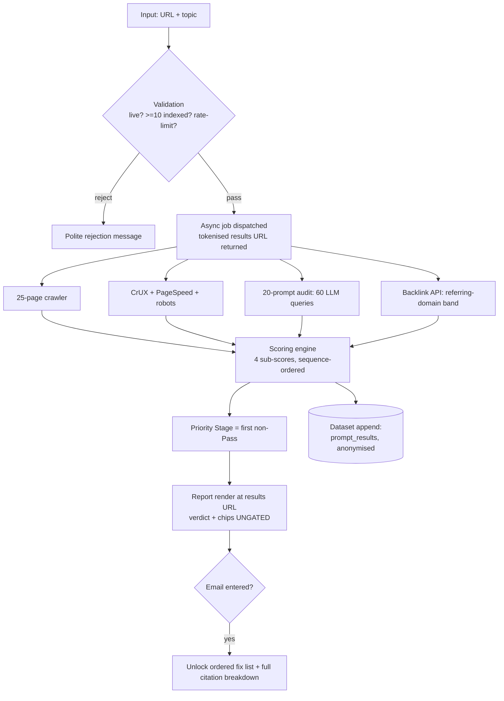

# Site Marketing Grader — Product Spec v1 + Launch Landing Copy

<!--
INTERNAL BUILD DOCUMENT (Part A) + SHIPPABLE LANDING COPY (Part B) in one file.
This split is a known compromise. In production these are TWO artifacts:
  - Part A: this spec, stays in the repo as an engineering document (no public URL).
  - Part B: deployed as the live tool landing page at /grader/ (front-matter is inside §10).
A spec reader stops at the horizontal rule before §10. A copywriter starts there.

Production notes / infra requirements:
- Reuses the 20-Prompt AI Visibility Audit engine (content/product/20-prompt-ai-visibility-audit.md)
  as the Measure module. Same 3 engines, same frozen prompt-set v1, same 60-call budget,
  same $0.60 kill-switch. DO NOT fork the prompt set — comparability to the 8% pilot median depends on parity.
- New outbound integrations beyond the audit engine: CrUX API, PageSpeed Insights API,
  a free-tier backlink API (referring-domain count only), robots.txt fetch, single-page render (headless).
- Postgres (or equivalent) for the 5 tables in §4. `cited_domains` and per-signal detail need JSON columns.
- Async job runner + tokenised results-URL store (see §6). No email required to START a run.
- Transactional email provider for fix-list unlock + 3-email nurture. No pre-ticked consent (§6).
- /grader/ is a NET-NEW top-level surface. Confirm routing/hosting before week 4.
- Schema on the landing page (§10): WebApplication + FAQPage + BreadcrumbList.
  Report page is app state, not an indexable page — noindex the tokenised results URLs.
- Bot access on /grader/ landing: GPTBot, ClaudeBot, PerplexityBot, Google-Extended all ALLOW.
-->

## §0 — Spec header

| Field | Value |
|---|---|
| Product | Site Marketing Grader (free, existing-site marketing grader) |
| Live tool URL | `/grader/` |
| One-line definition | Enter a URL + topic; get four sequence-ordered sub-scores, one Priority Stage verdict, and an ordered fix list capped at 10 items — no blended 0–100 composite, ever. |
| Owner | Sunny |
| Builder | Sunny + 1 engineer |
| Status | Draft — pending kickoff |
| Ship target | 6 weeks from kickoff |
| Version | v1 (scoring rules v1; Measure reuses prompt-set v1) |
| Primary purpose | Lead instrument for `/strategy/audit/` + data flywheel for the citation-share dataset |

**Assumptions stated up front:** (a) the **8% median** is the frozen figure from our informal 50-site, 3-engine pilot — treated here as a published constant pinned to prompt-set v1, exactly as in the audit-engine spec; (b) the Grader's Measure module *is* the existing 20-Prompt AI Visibility Audit at prompt-set v1, so its citation-share number is directly comparable to that 8% pilot median; (c) "current default model" and "current pricing" mean as-of build date, pinned in config; (d) Grader runs are a **self-selected convenience sample** — they feed a supplementary dataset reported separately from the controlled 200-site study, never silently folded into its headline (see §4, dataset rule).

---

# PART A — PRODUCT SPEC

*Register: technical-spec. Flat, declarative. Zero marketing voice until the horizontal rule before §10.*

## §1 — Product definition & non-goals

**Definition.** The Site Marketing Grader is a free web tool. Input: one root-domain URL and one primary topic (a phrase, e.g. "payroll software"). Output: four sub-scores in fixed **sequence order** — Measure, Fix, Strengthen, Amplify — a single **Priority Stage verdict**, and an **ordered fix list capped at 10 items**. It productises the Measure → Fix → Strengthen → Amplify framework from the pillar (`/how-to-market-a-website/`): the report's structure *is* the framework.

**Named position #1 — no composite.** The Grader never emits a blended 0–100 number. Incumbent graders (HubSpot Website Grader, Seobility, WooRank) collapse everything into one score, which tells an owner nothing about what to do *first*. Our headline output is a verdict sentence: *"Your priority stage is FIX."* The composite is not de-emphasised; it does not exist.

**Named position #2 — data flywheel, not just a lead magnet.** Every anonymised run appends to the citation-share dataset. The `prompt_results` table (§4) is the dataset. Target: publish the Grader-sample benchmark at **n=500 runs**, refreshed quarterly, always reported separately from the controlled 200-site study and caveated for self-selection.

**Named position #3 — a plan, not a filing cabinet.** The fix list is hard-capped at **10 items**. A 40-item audit dump is a filing cabinet; a ranked 10 is a plan.

**Non-goals (explicit):**

- Not an SEO audit suite. It grades sequence and hands one ordered list; it does not enumerate every issue.
- Not a rank tracker. No keyword positions, no ongoing monitoring (that's `/measurement/citation-monitoring/`).
- Not a new-site tool. Domains with **<10 indexed pages** are rejected with a polite message (§2). The whole method assumes historical data and a live inventory.
- Not a competitor comparison, PDF generator, or agency white-label tool in v1 (§7).

---

## §2 — Inputs

| Field | Required | Validation | Failure message |
|---|---|---|---|
| Root domain URL | Yes | Resolves (DNS + live 200/301 check); strip scheme + `www.` | "We couldn't reach that site. Check the URL and try again." |
| Primary topic | Yes | 2–6 word phrase | "Give us the one phrase your buyers would search — e.g. 'payroll software'." |
| Money page URL | No | Same-domain; live; defaults to homepage if blank | "That page isn't on the domain you entered — using your homepage instead." |
| Indexed-page floor | (derived) | ≥10 indexed pages, estimated via SERP-API `site:` sampling (no scraping) | "This grader is for established sites. Come back once you've got a bit of history indexed." |
| Rate limit | (derived) | 1 run per domain per 7 days; IP-level throttle; bot challenge on submit | "This domain was graded in the last 7 days. You can view the existing report: [link]." |

**Shared-link gate state.** The rate-limit response links the existing report. That link always renders in its **gated** state for a new visitor — verdict and chips ungated, fix list locked. Unlock is per-visitor via email (§6) and is never encoded in the results URL, so a shared or re-surfaced link never exposes another visitor's unlocked report.

**Email is NOT an input.** It is captured on the results page to unlock the fix list (§6) — never to start a run. This is a deliberate inversion of the standalone 20-Prompt Audit tool, which gates email *before* the run because it is a pure lead instrument. The Grader gates *after* the verdict because the verdict is engineered to be screenshot-shared. The two tools share the Measure engine, not the gate placement.

**Cost control without an email gate.** Because there is no email-before-run gate, abuse and cost are controlled by: the per-domain 7-day limit above, IP throttling, a submit-time bot challenge, and the audit engine's **$0.60 per-run kill-switch**.

---

## §3 — The four sub-scores

One sub-score per stage. Verdict per stage: **Pass (≥70) / At Risk (50–69) / Fail (<50).**

**The wedge, stated as a rule:** the **Priority Stage is the first non-Pass stage in sequence order** — Measure, then Fix, then Strengthen, then Amplify. *A 40 in Measure outranks a 20 in Amplify. Sequence beats magnitude.* The scorecard is never sorted by score.

| Stage | Sub-score | Signals (v1) | Source |
|---|---|---|---|
| **Measure** | Visibility Score | AI citation share (20-prompt audit), indexed-vs-valuable ratio, organic SERP presence for topic | Prompt-audit module + `site:` sampling + SERP API |
| **Fix** | Foundation Score | Bot access, CWV field data, money-page render, crawlability, HTTPS, 5 money-page friction heuristics | CrUX + PageSpeed + robots fetch + single-page crawl |
| **Strengthen** | Content Score | Chunk-answerability, thin/duplicate ratio, `dateModified` freshness, inventory breadth | 25-page crawler |
| **Amplify** | Distribution Score | Brand-mention count in AI answers, referring-domain band, email-capture presence | Prompt-audit reuse + backlink API (free tier) + crawl |

### §3.1 — Measure: Visibility Score

Measures whether engines and search find you at all for your topic. Signal weights (sum 100):

- **AI citation share — 50.** The engine is the 20-prompt audit: topic → templated fan-out into 20 buyer-intent prompts → fired at ChatGPT, Perplexity and Gemini = **60 queries per run**. Citation share = answers citing the domain ÷ 60. Always shown against the **8% pilot median**.
- **Indexed-vs-valuable ratio — 25.** Of pages estimated indexed, the share that are on-topic and non-thin (sampled).
- **Organic SERP presence — 25.** Does the domain appear in the top results for the topic and near-variants.

Weighted highest on citation share because Measure exists to answer the AI-visibility question the rest of the site can't see.

### §3.2 — Fix: Foundation Score

Measures whether a machine — bot or renderer — can retrieve and read you. Signal weights (sum 100):

- **Bot access — 25.** GPTBot, ClaudeBot and PerplexityBot not blocked in `robots.txt`. Weighted highest because a blocked bot zeroes out retrieval regardless of everything else. Fail here → `/technical/llms-txt/`.
- **CWV field data — 20.** CrUX field data on the origin. **Degradation:** small sites frequently have no CrUX field data — this is expected, not a failure. Fall back to PageSpeed lab data, mark the signal "lab-only," and disclose it in the report. Never zero the stage for missing field data.
- **Money-page render — 20.** Does core content appear in initial HTML on the money page (single-page headless render vs raw HTML diff).
- **Crawlability — 15.** No accidental `noindex`, no crawl traps on the sampled set, sitemap present.
- **HTTPS — 5.** Binary, table-stakes; low weight by design.
- **Money-page friction heuristics — 15.** Five checks: visible primary CTA, above-fold value statement, form field count, load-blocking interstitial, mobile tap-target sanity.

### §3.3 — Strengthen: Content Score

Measures whether the content is worth citing. Signal weights (sum 100):

- **Chunk-answerability — 35.** H2-as-question rate, list/table density, presence of extractable direct-answer blocks. Weighted highest because it is the direct GEO citation lever. Fail → `/content/information-gain/`.
- **Thin/duplicate ratio — 30.** Share of the 25-page sample that is thin or near-duplicate. Fail → `/content/pruning/`.
- **`dateModified` freshness — 20.** Share of sampled pages updated within 12 months.
- **Inventory breadth — 15.** Does the sampled inventory actually cover the stated topic, or drift off it.

### §3.4 — Amplify: Distribution Score

Measures whether anything off-site compounds back on-site. This stage is deliberately **coarse**: Amplify is last in sequence and is rarely the Priority Stage, so v1 spends little precision here. Signal weights (sum 100), ordered by how directly each moves AI visibility:

- **Brand-mention count in AI answers — 45.** From the same 60 prompt answers, count answers that *mention* the brand (mention ≠ citation). The most direct signal an engine has already learned the brand exists.
- **Referring-domain band — 35.** Bucketed count from the free-tier backlink API. The classic authority proxy LLMs inherit via training. Bands, not exact counts, because free-tier data is coarse.
- **Email-capture presence — 20.** Does the site even have an owned-audience loop (visible signup). Binary proxy; the weakest of the three. Fail → `/distribution/email-moat/`.

Rationale for the grab-bag: all three answer one question — "does anything off-site feed back in?" — at three levels of directness. Precision is low-value at the last stage in v1.

---

## §4 — Data flow & data model



**Run budget.** 60 LLM queries ≈ **$0.40** API cost per run — the audit-engine figure at current pricing; ≤ **$0.50** with retries; hard **kill-switch at $0.60** (§2). Plus a 25-page crawl. **Wall time ≤8 minutes.** Delivered to a **live results URL** that polls and shows per-module progress — not a blocking spinner, and not gated behind "check your inbox." If the user gave an email to unlock, we also email the results-URL link as a convenience; the verdict itself never requires the inbox.

**Degraded output (partial runs).** Failures are handled per module, not by voiding the whole run:

- **A stage that depends on a failed engine cannot be scored** → mark that sub-score **Incomplete**, render every stage that *did* complete, and offer a free re-run that does not count against the 7-day limit. A citation share computed over a denominator smaller than 60 answers is **never shown** — a short-denominator score is not comparable to the 8% median (same rule as the audit-engine spec).
- Because Measure is first in sequence, an **Incomplete Measure blocks a definitive Priority Stage** — the report says so plainly rather than guessing.
- Missing CrUX field data is **not** a failure — fall back to lab data and disclose (§3.2).

**Data model — 5 tables.**

```sql
runs          (id, domain, topic, money_page_url, results_token,
               created_at, wall_ms, status)              -- status: complete|partial|voided
prompt_results(run_id, prompt_id, prompt_set_version, engine,
               cited bool, mentioned bool, position int,
               cited_domains jsonb, industry_tag, site_size_band,
               source)                                   -- THE dataset; source: grader|audit; no PII in aggregates
scores        (run_id, stage, subscore numeric, verdict, incomplete bool,
               signal_detail jsonb)                      -- stage: measure|fix|strengthen|amplify
fixes         (run_id, rule_id, stage, severity, cluster_page_url, evidence)
leads         (run_id, email, dataset_notice_version, captured_at)
```

`prompt_results` is designed for aggregation from day one: `industry_tag` and `site_size_band` on every row, `prompt_set_version` on every row (comparisons are only valid within one version — same load-bearing rule as the audit-engine spec), no PII in any aggregate. **Dataset rule:** Grader rows are a self-selected convenience sample. They carry `source = grader` and are reported as their own benchmark (target n=500), never merged into the controlled 200-site study headline. The 8% comparison shown in reports stays the **frozen pilot constant** pinned to prompt-set v1 — individual runs do not move a live median.

---

## §5 — Output report structure

Top to bottom, exactly:

1. **Priority Stage verdict banner** — one sentence: *"Fix before you amplify: your priority is FIX."*
2. **Sequence scorecard** — four stages left-to-right in fixed order, each a chip: **Pass / At Risk / Fail** (or **Incomplete**). Never sorted by score.
3. **Citation-share callout** — *"You appear in X% of AI answers about [topic]. Median for established sites: 8%."*
4. **Ordered fix list (max 10)** — ordered stage-then-severity, never by an "impact score." Each fix = rule name, one-line why, one link to the matching core cluster page. **[Gated — see §6.]**
5. **One CTA** — the 90-minute audit (`/strategy/audit/`).

**Accessibility.** Chips carry a **text label and an icon/shape**, not colour alone — PASS / AT RISK / FAIL / INCOMPLETE are legible in monochrome and to screen readers.

**Report wireframe:**

```
┌─────────────────────────────────────────────────────────┐
│  YOUR PRIORITY STAGE: FIX                                 │
│  Fix your foundations before you spend on distribution.   │
├─────────────────────────────────────────────────────────┤
│  MEASURE      FIX          STRENGTHEN     AMPLIFY         │
│  ● Pass 74    ▲ Fail 41    ■ At Risk 58   ● Pass 71       │
├─────────────────────────────────────────────────────────┤
│  Citation share: 11% of AI answers about "payroll         │
│  software".  Median established site: 8%.                  │
├─────────────────────────────────────────────────────────┤
│  YOUR ORDERED FIX LIST        [LOCKED — enter email]      │
│   1. …                                                    │
├─────────────────────────────────────────────────────────┤
│  Want the human version? → The 90-Minute Audit            │
└─────────────────────────────────────────────────────────┘
```

**Fixes catalog — the internal-link engine.** Every rule maps to **exactly one core cluster page** (one of the 35 = 7 core sections × 5). Glossary pages are *inline supplements*, never fix targets — that keeps the "one of 35" mapping honest.

| rule_id | Stage | Trigger | Mapped cluster page |
|---|---|---|---|
| `bot-access-blocked` | Fix | GPTBot/ClaudeBot/PerplexityBot disallowed | `/technical/llms-txt/` |
| `money-page-render` | Fix | Core content missing from initial HTML | `/technical/js-rendering/` |
| `cwv-poor` | Fix | CrUX/lab CWV below threshold | `/technical/core-web-vitals/` |
| `money-leak` | Fix | Money-page friction heuristics fail | `/conversion/audit/` |
| `zero-citations` | Measure | Citation share ≈ 0% | `/visibility/geo/` |
| `weak-serp` | Measure | No topic presence in organic results | `/visibility/topical-authority/` |
| `thin-content` | Strengthen | Thin/duplicate ratio high | `/content/pruning/` |
| `stale-content` | Strengthen | `dateModified` old across sample | `/content/audit/` |
| `not-answerable` | Strengthen | Low chunk-answerability | `/content/information-gain/` |
| `no-email-capture` | Amplify | No owned-audience loop | `/distribution/email-moat/` |

*Slug status: `/strategy/audit/` and `/visibility/geo/` are confirmed in the topical map; the remaining slugs are derived from that map's cluster-title list and most are not yet published. Confirming every rule→URL mapping is part of the wk-1 fixes-catalog milestone (§9) — no report links ship unverified.*

---

## §6 — Email capture flow

**Position.** The verdict, the four chips, and the headline citation-share number render **ungated** on the results URL. The **ordered fix list and the full 60-row citation breakdown are gated** behind an email. Rationale, stated: the verdict is shareable (screenshots = distribution); the fix list is the value (the lead trade).

**User flow:**

1. Run completes → verdict + chips + citation number render on the tokenised results URL (no email).
2. User clicks the locked fix list → inline email field.
3. On submit → fix list + full breakdown unlock **in place**; the results-URL link is also emailed so the user can return. Unlock is per-visitor — it is never baked into the URL (§2, shared-link gate state).
4. 3-email nurture begins. Hard stop at 3.

**Dataset notice.** A plain sentence at capture: *"We include anonymised, aggregate results in our citation-share benchmark. No personal data, ever."* No checkbox, pre-ticked or otherwise — the sentence version shown is logged as `dataset_notice_version` in `leads` (§4).

| Day | Subject | One goal |
|---|---|---|
| 0 | "Your grade + your ordered fix list" | Deliver the report link |
| 3 | "Why your priority stage is [STAGE]" | Explain sequence; link the pillar |
| 10 | "The human version: the 90-minute audit" | Offer `/strategy/audit/` |

---

## §7 — v1 scope cutlines

**Cutline rule:** anything that doesn't either (a) improve the fix list or (b) grow the dataset is out.

| IN (v1) | OUT (v1) — with reason |
|---|---|
| URL + topic input, everything in §2–6 | PDF export — the results URL + email cover it |
| English-language sites only | Multi-language — no calibrated thresholds for other languages in v1 |
| 3 engines (ChatGPT, Perplexity, Gemini) | Claude / Copilot as 4th–5th engines — the pilot median is 3-engine; adding engines breaks comparability |
| Static-HTML analysis + single-page render | Full-site JS rendering — cost/time blowout; single money-page render only |
| Four sub-scores + Priority Stage verdict | Blended 0–100 composite — banned by position #1 |
| Ordered fix list (max 10) | 40-item audit dump — filing cabinet, not a plan |
| Anonymous run + results URL + email unlock | Accounts / login — no persistence promise in v1 |
| Free re-runs allowed | Historical re-run dashboard — re-runs are fine; *tracking* them is the monitoring product |
| Dataset append | Competitor comparison — different product |
| — | White-label / agency mode — not a lead-instrument need |
| — | Public API — not a v1 audience |

Change requests are evaluated against the cutline rule only: a request that neither improves the fix list nor grows the dataset is rejected, regardless of effort estimate.

---

## §8 — UI notes

- Single input screen. No config, no options, no advanced tab.
- Report is one long, mobile-first page; the **verdict banner is visible without scrolling**.
- Scores render as **chips, not gauges**. **No speedometer graphics — named ban.** Gauges are how incumbents dress up score soup; a chip states a verdict, a gauge implies a continuum we reject.
- Chips carry label + icon/shape, not colour alone (§5 a11y).
- Sequence scorecard always renders left-to-right in stage order — the DOM order is the framework; it is never reordered by score.
- Locked fix list shows the *count* and the *stage headers* so the user sees the shape of what's behind the gate.
- Progress state shows per-module ticks (crawl / foundations / AI answers / distribution), never a single indeterminate spinner.

---

## §9 — Build plan — Sunny + 1 engineer, 6 weeks

| Week | Milestone | Owner |
|---|---|---|
| 1 | Scoring rules + full fixes catalog (all rule→cluster-page mappings verified against published slugs) finalised; 20-prompt fan-out templates confirmed at prompt-set v1 | Sunny |
| 1–2 | Crawler + CrUX/PageSpeed/robots integrations; `runs`/`scores` schema; results-URL job runner | Eng |
| 3 | Measure module wired to the audit engine (3 APIs, retries, $0.60 cost cap); degraded-output handling | Eng |
| 4 | Scoring engine + report render + email unlock + 3-email nurture | Eng |
| 5 | **Calibration run on 20 known sites** — Sunny hand-scores; tune thresholds so machine verdicts match judgment. Landing page (§10) live | Both |
| 6 | Launch: pillar link + LinkedIn + digital-PR pitch of the refreshed-dataset angle | Sunny |

**Hard dependency:** the fixes catalog (wk1) blocks report render (wk4) — the report *is* the catalog.

**Calibration is a hard gate.** No launch if machine Priority-Stage verdicts disagree with Sunny's hand-verdict on **>4 of 20** sites. Disagreement on the *stage* (not the exact number) is what counts — the verdict is the product.

---

*— End of Part A (product spec). Register switches below. Part B is finished, shippable landing copy in Sunny's voice; it should ultimately deploy to `/grader/` as its own file. —*

---

# PART B — LAUNCH LANDING COPY

<!-- Front-matter for the deployed page at /grader/ -->
```yaml
title: "Free Site Marketing Grader — Fix List, Not Score Soup"
meta_description: "Free grader for existing websites: four scores in sequence — Measure, Fix, Strengthen, Amplify — plus your AI citation share vs the 8% median. Ordered fix list, no score soup."
slug: /grader/
schema: [WebApplication, FAQPage, BreadcrumbList]
```

<!-- The URL + topic input form renders at the top of the page with id="grade"; the CTA button at the bottom anchors to it. -->

## Grade Your Website's Marketing — In the Order That Actually Matters

Every grader gives you a 73/100 and a shrug. This one gives you four scores in sequence and the one thing to fix first.

Most website graders dump a number on you and leave. 73 out of 100. Great. Fix *what*, first? They can't tell you, because a blended score can't. It's mixed a broken robots.txt in with a slow image and a missing meta description and averaged them into mush.

We don't do that. The Site Marketing Grader scores your site in the order the work actually happens — **Measure, Fix, Strengthen, Amplify** — and hands you back one verdict: *here's your priority stage, and here's the ordered list to work through.* No composite. No speedometer. No filing cabinet of 40 issues you'll never read.

### How it works

1. **Give us your URL and your topic.** One phrase — "payroll software", "wedding photography Leeds", whatever your buyers would actually type.
2. **We do the digging.** 60 AI queries across ChatGPT, Perplexity and Gemini, plus a crawl of 25 of your pages and your technical foundations. Takes about 8 minutes.
3. **You get a verdict.** Four scores in sequence, your priority stage, and a ranked fix list. The verdict's on screen straight away — the fix list opens with your email.

### What you get

- **Your AI citation share vs the 8% median.** The share of AI answers about your topic that actually cite you — measured against the median from our 50-site study. This is the number nobody else can give you.
- **Four scores in sequence, not one blended number.** Measure, Fix, Strengthen, Amplify — in order, so you can see where the chain breaks first.
- **One priority stage.** The first thing that's failing, in the order that matters. A 40 in Measure beats a 20 in Amplify every time. Sequence beats magnitude.
- **An ordered fix list, capped at 10.** Ranked. Each one links to exactly how to fix it. Ten, not forty — because a plan you'll act on beats an audit you won't.

### A word on the graders you've already tried

I've spent years cleaning up after score-soup graders. A client waves a 68/100 at me and asks what it means. It means nothing. It's three good things and two disasters, blended into a number that hides both. And the speedometer graphic? That little needle in the amber zone? That's a design choice to make a meaningless number feel precise. We banned both. You get a verdict and a list. That's the whole job.

### FAQ

**Is it actually free?**
Yes. The grader is free, the verdict is free, the fix list is free once you give us an email. There's no paywall and no "unlock your full score for $49." The paid thing is a human audit, and we only mention it once.

**Do you need my email?**
Yes — for the fix list. The verdict and your four scores show up on screen with no email at all — screenshot them, share them, whatever. The email unlocks the ranked fix list and the full citation breakdown. That's the trade, stated plainly.

**Will this work for a brand-new site?**
No. This is a grader for sites that already exist and have some history — roughly ten indexed pages or more. If you launched last week there's nothing to measure yet. Come back once you've got a footprint.

**What's citation share?**
It's the share of AI answers about your topic that actually cite your site as a source — not just mention your name, cite you with a link. We measure it across 60 prompts on three engines. More on the term here: [what GEO means](/glossary/geo/).

**Is this just an SEO audit?**
No. An SEO audit lists everything wrong with your site. This grades the four stages of marketing an existing site *in order* and tells you which one to fix first. Different job. If you want the whole framework, start with [how to market a website](/how-to-market-a-website/); if you want a human to walk your site, book [the 90-minute audit](/strategy/audit/).

<div class="cta">

### [Grade my site](#grade)

</div>