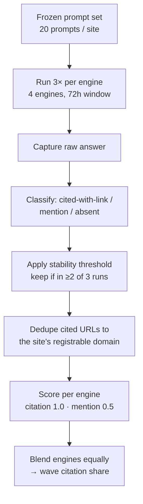

<!-- ============================================================
FILE 1 (PUBLIC): content/research/citation-share-study-methodology.md
============================================================ -->

---
title: "The Citation-Share Study: Methodology for the 200-Site AI Visibility Benchmark"
description: "The methodology behind the 200-site AI citation-share benchmark: the 20-prompt instrument, four engines, scoring rules, and a quarterly refresh cadence."
slug: /research/citation-share-study
section: "Teardowns & Benchmarks"
type: methodology
version: "2.0"
dateModified: 2026-07-23
---

<!--
PRODUCTION NOTES (do not publish this block)
- Schema: Article + Dataset + FAQPage + BreadcrumbList. Author Person schema for Sunny Patel with sameAs → LinkedIn.
  - Dataset schema: name, description, creator (Organization site.marketing), temporalCoverage (per wave), distribution (aggregate CSV URL, encodingFormat text/csv), isAccessibleForFree true, license. Populate distribution.contentUrl only once wave 1 CSV is live — leave omitted until then.
  - FAQPage: mark up the four Q&A pairs in the FAQ section only.
- This is the PUBLIC methods page. The PR angles, press-target list, and the internal wave plan live in a SEPARATE, noindex file: content/research/citation-share-study-pr-playbook.md. Do NOT merge them back into this file or place them behind an HTML comment fence here — comment fences ship in repo source and rendered output.
- Every scale figure on this page is a DESIGN TARGET, not a measured result. Wave 1 is fielded after this page publishes (methods-first sequencing). Keep future/design tense on republish until wave 1 results exist.
- Aggregate CSV per wave: link is forthcoming. Do not present as downloadable until the first wave closes.
- Verify GPTBot, ClaudeBot, PerplexityBot, Google-Extended access per bot policy. All content in initial HTML — no client-side rendering.
- Mermaid data-flow (§5) renders the scoring transformation; the §6 ordered list is the operational pipeline. They are deliberately different views — do not collapse into one.
-->

# The Citation-Share Study: Methodology for the 200-Site AI Visibility Benchmark

**AI citation share is the proportion of relevant AI answers about a site's own topics in which that site is cited — by attributable link or explicit named mention — across the major answer engines. The Citation-Share Study measures it at scale: 200+ sites, 20 site-specific prompts each, across four answer engines, refreshed quarterly. An informal 50-site pilot found a median citation share of 8%. This expanded study is designed to test whether that figure holds at n=200 and to break it down by vertical and site size.**

This page is the methodology. It documents the instrument, the scoring rules, the site frame, the controls, and the refresh cadence in enough detail that the numbers can be verified — and replicated — before they are quoted. The findings themselves are published separately, wave by wave.

### Study at a glance

| Field | Value |
|---|---|
| Sites | 200 core (8 verticals × 25), plus a 20-site GEO-active oversample reported separately (220 total) |
| Prompts per site | 20 (site-specific, frozen per wave) |
| Engines | 4 in the blended score: ChatGPT, Perplexity, Gemini, Claude |
| Runs per prompt | 3 per engine (stability control) |
| Observations per wave | 16,000 (200 × 20 × 4); 48,000 answer samples including the 3× runs |
| Refresh | Quarterly (launch wave August 2026; Jan / Apr / Jul / Oct grid from wave 2) |
| First wave | Fielded August 2026; results published September 2026 |
| Methodology version | v2.0 (this document) |

Each wave is designed to generate **200 sites × 20 prompts × 4 engines = 16,000 observations, run three times for stability = 48,000 answer samples.** The 20-site GEO-active oversample adds 1,600 further observations, tagged and reported on its own — never folded into the headline figures.

---

## 1. Why This Study Exists

Rank tracking measured a world where a query returned a list of links. That world is contracting. Answer engines increasingly resolve a question inside the response, citing a handful of sources rather than ranking ten. The question that matters is no longer "where does this page rank" but "how often is this site the source the model cites." Citation share is the successor metric to rank tracking as the primary visibility KPI for AI search — and unlike rank, it has no public index behind it, so it has to be measured directly.

An informal pilot of 50 established sites — 20 buyer-language prompts each, across ChatGPT, Perplexity and Gemini — found a median citation share of **8%** before any [GEO](/visibility/geo/) work. That number is the baseline this study formalises and stress-tests. At n=50 the finding cannot be segmented: it is one median with no defensible cut by vertical or by site size. At n=200, stratified into eight verticals of 25 sites across three size bands, it can be — each vertical carries enough sites to report a median that isn't driven by one or two outliers, and each size band within a vertical holds roughly eight sites, enough to say something directional about how citation behaviour changes with a site's footprint. The expanded study exists to answer the questions the pilot raised: does 8% hold at scale, and where does it diverge?

The pilot also used three engines. This study adds Claude as a fourth, because a benchmark that omits a major answer engine measures the market as it was, not as it is. Adding an engine changes the blended figure by construction, which is exactly why the pilot and this study are versioned separately (§7) rather than presented as one continuous line.

| Study | n (sites) | Engines | Segmentation |
|---|---|---|---|
| Pilot (v1, informal) | 50 | 3 (ChatGPT, Perplexity, Gemini) | None — single median |
| Expanded (v2, this doc) | 200 + 20 oversample | 4 (adds Claude) | By vertical (8) and size band (3) |
| Future waves (v2.x) | 200+, rotating 25% of prompts yearly | 4, reviewed each wave | Longitudinal deltas per segment |

The pilot informs the pillar that uses this baseline, [the existing-site playbook](/how-to-market-a-website/), and the operational side is covered under [AI citation monitoring](/measurement/citation-monitoring/). This document is upstream of both: it is the instrument they cite.

---

## 2. Metric Definition: Citation Share

**Citation share is the number of answers in which a site is cited — with an attributable link or an explicit named mention — divided by the total relevant answers returned for that site's 20-prompt set, calculated per engine and then blended across engines with equal weight. A relevant answer is one the engine returns for a prompt in the site's frozen set. Mentions without a link count at half weight in the blended score.**

That definition is the unit every figure in this study is built from. It stays deliberately free of interpretation so it can be quoted as-is.

Every answer is logged in one of three states:

| Observation | Counts as | Weight in blended score |
|---|---|---|
| Cited with an attributable link to the site's own domain | Citation | 1.0 |
| Named explicitly, no link (a "mention") | Mention | 0.5 |
| Not cited and not named | Absent | 0 |
| Cited only via a syndicated or mirrored copy on a domain the site does not control | Absent | 0 |
| Cited in a Google AI Overview carousel with the domain visibly attributed | Observational only | Not in blended score (see §5) |

**Blended share weights the four engines equally, not by their traffic.** Traffic weights shift month to month; equal weights keep waves comparable to one another, which is the entire point of a longitudinal benchmark. A secondary **mention share** metric counts named-without-link observations at full weight, for readers who care about brand presence independent of link attribution. (How cited and mentioned answers convert into measurable visits is a separate question, covered under [tracking AI traffic](/measurement/tracking-ai-traffic/).)

**Mentions count at 0.5, not 0 and not 1.** A named-without-link mention is real visibility — the model has learned the site is an authority on the topic and says so — but it is worth less than a citation that sends attributable credit and, potentially, a click. Zero would erase a genuine signal; full weight would treat a passing name-drop as equal to a linked source. Half is the defensible middle, and the secondary mention-share metric reports the same observations at full weight for anyone who disagrees with that call. Publishing both numbers means the weighting choice does not have to be trusted — it can be inspected.

**Central tendency is reported as the median, not the mean.** Citation share is skewed: a handful of GEO-heavy sites sit far above the pack, and a mean would let them drag the headline number upward and misrepresent the typical site. The median describes the site in the middle of the distribution, which is the site most readers are trying to locate themselves against. Where the spread matters, the findings report the distribution, not a single point.

**A "relevant answer" is one the engine actually returns on the prompt's topic.** Answer engines do not always answer. An engine may refuse, return nothing on-topic, or ask a clarifying question instead of responding. Those are logged as a distinct "no answer" state and **excluded from the denominator for that engine on that prompt** — a null return is neither a citation nor an absence, and counting it as an absence would penalise a site for an engine's behaviour rather than for the site's own visibility. Citation share is therefore computed over the relevant answers an engine returned, not over the full 20-prompt set where an engine declined to answer. The count of no-answer returns is itself logged and reported, because a rising refusal rate is a finding in its own right.

**Worked examples**

- **The site's content is quoted, but the answer links a competitor.** If the site is named, it is a mention (0.5). If it is not named at all, it is absent (0).
- **The site appears only through a syndicated copy on a third-party domain.** Absent (0). Only the site's own registrable domain earns a citation.
- **The site is named in a Google AI Overview source carousel with its domain shown.** Recorded as a citation in the AI Overviews observational track only — never in the blended score.
- **The answer links the site's own blog subdomain** (e.g. `blog.example.com` when the studied domain is `example.com`). Citation, full weight — a site's own subdomains dedupe to its registrable domain.

First-mention definitions: [GEO](/glossary/geo), [AEO](/glossary/aeo), and [information gain](/glossary/information-gain).

---

## 3. Site Selection Frame (n=200+)

Sites qualify for inclusion on five criteria, and are excluded on three. The criteria are fixed before sampling so the frame cannot be shaped to a desired result.

**Include** — a site must be:

- Live for at least 24 months
- At least 100 indexed pages
- English-language
- A measurable organic footprint (≥1,000 estimated monthly organic clicks)
- Assignable to exactly one of the eight study verticals

**Exclude:**

- News publishers (citation dynamics are driven by recency, not topical authority)
- User-generated-content platforms (the domain is cited for content it did not author)
- Any current or former client of site.marketing (conflict of interest — stated plainly, and enforced by exclusion, not by disclosure alone)

**Stratification.** The frame is 8 verticals × 25 sites = 200, split across three size bands (small / mid / large by estimated organic clicks), roughly evenly within each vertical:

| Vertical | Sites | Size bands |
|---|---|---|
| SaaS | 25 | small / mid / large |
| Ecommerce | 25 | small / mid / large |
| Local services | 25 | small / mid / large |
| B2B services | 25 | small / mid / large |
| Finance | 25 | small / mid / large |
| Health | 25 | small / mid / large |
| Travel | 25 | small / mid / large |
| Education | 25 | small / mid / large |
| **GEO-active oversample** | **20** | **tagged separately, not in the 200** |

**Sampling source.** Each vertical has a fixed seed-keyword set — a small list of category head terms agreed before sampling. Top-pages exports from Ahrefs and Semrush against those seeds produce a pool of sites ranking for the vertical's core topics. Size bands are cut by percentile of estimated monthly organic clicks *within that vertical's pool* — bottom third, middle third, top third — so "large" means large for its vertical, not large in absolute terms (a large local-services site and a large SaaS site are not the same size, and forcing them onto one absolute scale would empty the small band in some verticals and the large band in others). Sites are then drawn at random from within each band until the band is filled.

Sites are not hand-picked. A hand-picked sample lets a study choose the cases that flatter its thesis. Fixing the seed set, the percentile cuts and the randomisation before any answer is collected removes that degree of freedom — the frame is decided, then the data is collected against it, never the other way round.

The 20-site GEO-active oversample is a separate cohort of sites already known to invest in GEO. It exists to characterise the high end of the distribution, and it is always reported on its own so it never inflates the headline medians.

---

## 4. The 20-Prompt Instrument

The 20 prompts per site are not generic. Generic prompts measure a category; site-specific prompts measure whether *this* site is cited on the topics it actually competes for. Each site's set is built to a fixed grammar — four prompt types, five prompts each — and the grammar is published in full below. Publishing it is the point: anyone can replicate the instrument, but no one can backfill the longitudinal record it produces.

| Prompt type | Count | Seed source | Worked example (PipeWorks Supply — wholesale plumbing supplies for contractors) |
|---|---|---|---|
| Category | 5 | Category + buyer use case | "best wholesale plumbing suppliers for commercial contractors" |
| Informational | 5 | The site's top-10 organic pages | "how do I size a PEX manifold for a two-bathroom house" |
| Comparison | 5 | Site's category vs alternatives | "wholesale plumbing supplier vs big-box retailer for contractors" |
| Branded-adjacent | 5 | The problem the brand solves, brand not named | "where can contractors buy bulk plumbing fittings at trade prices" |

The literal templates, filled per site from that grammar:

```
# 5 CATEGORY prompts
best {category} for {buyer_use_case}
top {category} for {audience} in {year}
what is the best {category} for {constraint}
recommended {category} for {segment}
which {category} are worth considering for {use_case}

# 5 INFORMATIONAL prompts (one per top organic page, taken from its primary question)
{informational_question_the_page_answers}   # ×5, seeded from top-10 organic pages

# 5 COMPARISON prompts
{site_category} vs {adjacent_category} for {audience}
{product_type} compared to {competitor_product_type}
alternatives to {category}
is {approach_A} or {approach_B} better for {use_case}
{option_1} or {option_2} for {segment}

# 5 BRANDED-ADJACENT prompts (the job-to-be-done; brand name never used)
how do I solve {problem_the_brand_solves}
who can help with {problem}
what is the best way to {job_to_be_done}
tools/providers for {problem}
{problem} — what are the options
```

Each prompt type tests a different visibility question, which is why all four are needed rather than twenty of one kind:

- **Category** prompts test presence in high-intent commercial answers — the "best X for Y" question a buyer asks near a decision.
- **Informational** prompts test whether a site's own best content is retrieved on the very questions its top pages already answer. A site can rank on Google for a question and still not be the source an engine cites on it.
- **Comparison** prompts test whether a site surfaces when a buyer is actively weighing options against alternatives.
- **Branded-adjacent** prompts test discoverability when the buyer does not yet know the brand exists — the hardest and most telling case, because nothing about the prompt points the engine toward the site.

**Prompts are frozen per site for four waves (roughly one year), then 25% (five prompts) are rotated** to control for staleness without breaking the trendline. Rotation targets the five prompts returning the highest no-answer rate over the preceding waves — the ones that have stopped producing a usable signal — and replaces them under the same grammar, in the same type, so the four-type balance is preserved. Each rotation is versioned and noted against the affected site. A frozen set is what makes a wave-over-wave delta a measurement of the site rather than an artefact of a reworded prompt. See also [query fan-out](/visibility/query-fan-out/), which is why site-specific prompts matter more than head terms.

---

## 5. Engines, Runs and Controls

Four engines are in the blended score. Google AI Overviews is logged as a fifth, observational-only track.

| Engine | Mode | In blended score? | Notes |
|---|---|---|---|
| ChatGPT | Default model, search on | Yes | — |
| Perplexity | Default | Yes | Native citation UI |
| Gemini | AI Mode | Yes | Google's Gemini-powered answer surface; distinct from AI Overviews below |
| Claude | Search on | Yes | Added in v2; not in the pilot |
| Google AI Overviews | Where triggered | No | Trigger rate varies too much between prompts to be comparable; logged in the observations table and reported in a separate appendix, never blended |

These four are in scope because each has meaningful answer-engine reach and a citation surface that can be parsed consistently. Other assistants — including Copilot, Grok and Meta AI — are out of scope for v2, not on principle but because adding an engine means adding it to every prior wave's re-score to keep the trendline honest (§7); engines are added deliberately and versioned, not opportunistically. The engine roster is reviewed each wave, and any change is recorded in the changelog.

**Controls.** Every observation is captured under the same conditions:

- Fresh sessions, no logged-in account or personalisation history
- US location via a consistent egress
- The engine's default model with search/browse enabled
- Each prompt run **3 times per engine within a 72-hour window**
- **A citation counts only if it appears in at least 2 of the 3 runs** — the stability threshold
- The same operator-independent parse rules applied to every answer

The ≥2-of-3 threshold is the anti-cherry-picking rule. Answer engines are non-deterministic; a citation that shows up once and vanishes twice is noise, and counting it would let any wave be talked up or down by re-running until the number cooperates. Requiring stability across a majority of runs is what makes a reported figure defensible rather than anecdotal.

**Attribution and parsing.** A citation is attributed by matching the answer's linked or named source to the site's registrable domain, after deduping the site's own subdomains to that domain (§2). Every answer is classified — cited-with-link, mention, absent, or no-answer — under a fixed, documented rubric applied the same way to every engine, so the classification does not depend on who ran it. The domains of competing sites cited in the same answer are logged in `competitor_domains` (§6); they are not part of a site's own score, but they are what makes the engine-divergence and vertical-league analyses possible in the findings. The 5% manual QA sample (§6) exists specifically to check the automated classification against the raw logs before any figure is released.

The scoring transformation — how a raw answer becomes a score:



---

## 6. Data Model and Pipeline

Where §5 shows how an answer becomes a score, this section documents the systems that produce, store and publish it.

**In scope (v2):** the prompt registry, immutable run logs, per-answer citation records, wave-level scores, and a public aggregate CSV per wave.

**Data model** — four tables:

```sql
sites (
  site_id, domain, vertical, size_band, geo_active BOOLEAN
)

prompts (
  prompt_id, site_id, type, text, frozen_wave
)

observations (
  observation_id, prompt_id, engine, run_no,
  state,              -- cited | mention | absent | no_answer
  cited_url,          -- nullable
  competitor_domains  -- array
)

wave_scores (
  site_id, engine, wave,
  citation_share, mention_share, blended
)
```

**Pipeline** — the operational job, per wave:

1. Load the frozen prompt registry for the wave.
2. Dispatch runs — via official engine APIs where they exist, and through logged browser sessions where they do not. (Stated plainly because this is a methods document: not every engine exposes an API that returns the same answer surface a user sees, so some capture is browser-based.)
3. Write raw run logs as an immutable record.
4. Parse run logs into the `observations` table under the fixed classification rules.
5. Compute `wave_scores` (per engine, then blended).
6. QA a 5% sample by hand against the raw logs before any figure is released.
7. Export the public aggregate CSV and commit the wave's DuckDB file.
8. Publish the wave.

The warehouse is a single DuckDB file per wave plus the published aggregate CSV — chosen so a wave is reproducible from one portable file with no server to stand up, and so the aggregate can be checked by anyone with a spreadsheet. Raw run logs are written once and never edited; scores are derived from them, so any figure can be traced back to the exact answer that produced it, and any rule change can be re-applied to the original answers rather than re-fielded (§7). **Out of scope for v2**, each deferred deliberately:

| Deferred to a future version | Why not in v2 |
|---|---|
| Sentiment of a mention | Adds a subjective layer before the objective baseline is established |
| Position-in-answer weighting | Answer layouts differ too much across engines to weight fairly yet |
| Non-English coverage | Locale controls (§5) would have to be rebuilt per market |
| Paid-placement detection | Engines do not label sponsored citations consistently enough to detect reliably |

---

## 7. Refresh Cadence and Versioning

**Waves are quarterly, with results published within three weeks of a wave's field window closing.** Wave 1 fields in August 2026 as the launch wave; from wave 2 onward the study runs on a standing January / April / July / October grid, which keeps every subsequent wave-over-wave interval a clean quarter. Quarterly is the correct cadence for this study: monthly is noise, because engine model updates swamp site-level change over 30 days; annual is too slow to catch the shifts the study exists to track. Quarterly is the floor for a trend claim, and the ceiling on how stale a benchmark can be before it stops being useful.

| Wave | Field window | Results published |
|---|---|---|
| Wave 1 (launch) | August 2026 | September 2026 |
| Wave 2 (grid begins) | October 2026 | November 2026 |
| Wave 3 | January 2027 | February 2027 |
| Wave 4 | April 2027 | May 2027 |

**How wave-over-wave change is reported.** A quarterly delta is only worth publishing if it can be distinguished from noise, so the findings follow three reporting rules. Medians are reported with an interquartile range, and segment medians carry a bootstrap confidence interval, so a reader can see how much a headline figure could move on resampling alone. A segment-level delta is described as a *trend* only when it persists across two consecutive waves or exceeds the spread observed across the 3× runs within a single wave — one-wave movements are reported as movements, not trends. And because an engine model update can move every site's score at once (§8, limitation 5), engine-level shifts are reported alongside site-level deltas, so a change in the engine is never silently presented as a change in the sites.

The methodology is versioned with semver, and this document is **v2.0**. The versioning rules:

1. Any change to a scoring rule triggers a **re-score of every prior published wave** under the new rule, so a trendline never mixes two rule sets. Because the raw run logs are stored immutably (§6), a rule change is re-applied to the original answers rather than requiring the waves to be re-fielded — the history is preserved, only the scoring is recomputed. Both the pre-change and post-change figures are recorded in the changelog when this happens.
2. Prompt sets freeze for four waves, then 25% rotate; rotations are versioned and noted against the affected sites.
3. Every change is recorded in the public changelog below.
4. A version bump on this document is the only thing that changes how a figure is calculated — figures never move silently between waves.

```text
CHANGELOG
v2.0 — 2026-07  Expanded frame to 200 sites (8 verticals × 25) plus a 20-site
                GEO-active oversample. Added Claude as the fourth blended engine.
                Formalised scoring weights (mention 0.5), the ≥2-of-3 stability
                threshold, and the quarterly cadence. Supersedes the informal
                50-site, 3-engine pilot (v1 — findings cited on this site;
                methodology not previously published).
```

---

## 8. Limitations

These are published prominently and on purpose: a benchmark is only as reliable as the caveats that travel with it, and collecting every source of uncertainty in one place is what allows the rest of this document to state its rules without hedging.

1. **Engine non-determinism.** Answers vary run to run. The ≥2-of-3 stability threshold reduces this but does not remove it.
2. **US-English bias.** A single locale and language. Results do not generalise to other markets.
3. **Prompt-frame sensitivity.** Citation share depends on how a prompt is worded. The published grammar is one defensible frame, not the only possible one.
4. **The GEO-active oversample is not representative.** It characterises the high end and is always reported separately from the medians.
5. **Model-update confounding.** An engine's model can change between waves and move a score independent of any change on the site.
6. **Conflict of interest.** site.marketing sells services informed by this data. Sites it consults for are excluded from the frame, and the relationship is disclosed rather than assumed away.

---

## FAQ

**What is AI citation share?**

AI citation share is the proportion of relevant AI answers about a site's own topics in which that site is cited — by attributable link or explicit named mention — measured per engine and blended across engines with equal weight. Mentions without a link count at half weight. It is the AI-search successor to rank position.

**How is this different from rank tracking?**

Rank tracking measures where a page sits in a list of blue links. Citation share measures how often a site is the source an answer engine actually cites when it resolves a question inside the response. There is no public index of citations, so unlike rank it has to be measured directly, engine by engine — which is what this study does.

**Can I run this on my own site?**

Yes. The full prompt grammar (§4), scoring rules (§2) and controls (§5) are published so the instrument is replicable on a single site. A lighter DIY version is documented under [AI citation monitoring](/measurement/citation-monitoring/). What cannot be replicated is the longitudinal, cross-site record — that is the part the study accumulates over quarters.

**Is the raw data available?**

Aggregate data: yes — a public aggregate CSV is published with each wave (forthcoming with wave 1). Site-level raw data: no. Naming individual sites' scores would expose sites that never consented to being benchmarked and would invite gaming of the instrument; the aggregate serves the analysis without either cost.

Related: [AI citation monitoring](/measurement/citation-monitoring/), [tracking AI traffic](/measurement/tracking-ai-traffic/), and the [90-minute website marketing audit](/strategy/audit/).
