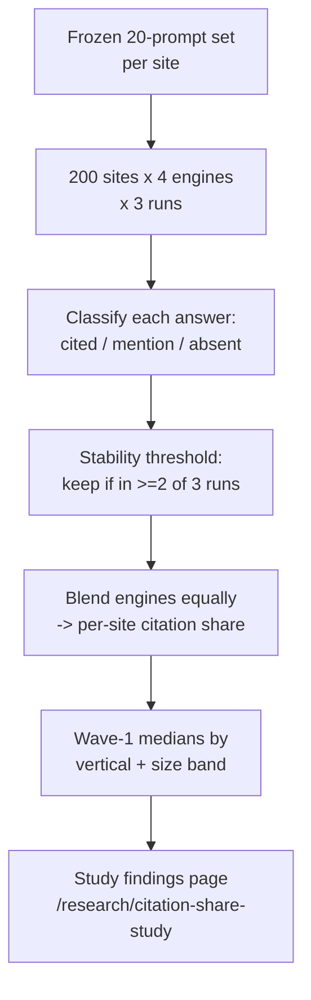

<!--
PRODUCTION NOTES (do not publish this block)
- Schema: Article + FAQPage + BreadcrumbList. Author Person schema for Sunny Patel, sameAs -> LinkedIn.
  - FAQPage: mark up only the three Q&A pairs (the "Why publish nothing…", "Does the no-drip rule
    expire…", and "Why teardowns before…" blocks). Do not mark up scoreboard rows as FAQ.
- Visible dateModified on page. All content in initial HTML — no client-side rendering.
- Verify GPTBot, ClaudeBot, PerplexityBot, Google-Extended access per bot policy before publish.
- REFRESH COMMITMENT (on-page, stated): the Day-90 scoreboard is re-published with measured
  actuals on Day 90. At that point this page becomes its own case study — the second
  information-gain payload. Keep the "Target" column; add a "Measured" column on the Day-90 pass.
- SLUG LOCK: cluster slugs for Sections 2-7 (/visibility/*, /content/*, /technical/*, /conversion/*,
  /distribution/*, /measurement/*) are provisional per content/strategy/topical-map.md line 93 and
  the glossary batch link policy (content/glossary/batch-01.md). Measurement slugs specifically vary
  across repo files (/measurement/tracking-ai-traffic/ + /measurement/citation-monitoring/ used here,
  matching content/research/citation-share-study-methodology.md v2.0; the pillar currently uses
  /measurement/ai-traffic/). Confirm against the published pillar before this page ships; some
  targets are forward-references to pages this very plan publishes in weeks 5-13 (they resolve to
  their section root until the cluster ships, per the glossary batch's [PHASE-2] policy).
- DATE RECONCILIATION: this page runs in relative day/week terms deliberately. The public study
  methodology commits wave 1 to an August 2026 field window and September 2026 publication. If the
  calendar start date pins Day 71 later than September, either pull the study-publication milestone
  to ~Day 60 or version the methodology's wave-1 dates BEFORE this page ships — the two public
  pages must not disagree on a checkable date.
- Source-of-truth numbers inherited, zero drift: 8% median citation share = the informal 50-site,
  3-engine pilot (content/research/citation-share-study-methodology.md, content/product/*). The
  200-site benchmark is the study's v2.0 expanded frame, wave 1 fielded in the plan's weeks 5-8.
  The grader ships 3 engines (pilot parity), the study ships 4 (adds Claude) — do not conflate.
-->

# The site.marketing 90-Day Launch Plan: 21 Pages on Day One

This is the operating document behind the site.marketing launch: 90 days, two people, 45 hours a week, and zero paid media. It runs on three milestones — **Launch Day 29, Grader Beta Day 57, and Citation-Share Study Day 71** ([jump to the Day-90 scoreboard](#day-90-targets)). The plan applies the site's own sequencing doctrine to its own launch: days 1 through 28 publish nothing, and Day 29 publishes a complete 21-page topical section in a single deploy. Nothing publishes until everything in the launch set publishes. The rest of this document is dates, hours, and verdicts; the one editorial liberty taken is calling that a plan instead of a dare.

## The Doctrine This Plan Obeys

The plan is not novel strategy. It is the [existing-site playbook](/how-to-market-a-website/) and the [topical-authority doctrine](/glossary/topical-authority/) turned on the launch itself, as three hard constraints:

1. **Minimum 20 pages, same day.** *"A pillar orphaned at launch is a press release, not an authority signal."* Coverage is a multiplier; one page multiplied by nothing is nothing. The launch commits to 21. Days 1-28 hold; Day 29 lands the set.
2. **Links flow inward and upward.** Cluster pages link up to the pillar; glossary pages link up to clusters and pillar relentlessly. Every page in the launch set has a parent on Day 1. Zero orphans is a release gate, not an aspiration.
3. **Original data before outreach.** You pitch a number, not a website. The citation-share study — not the launch — is the press moment. The launch earns the audience; the study gives that audience something no one else has.

The same doctrine sets the internal budget: content leads, distribution follows, per the [SEO vs GEO vs CRO](/strategy/seo-vs-geo-vs-cro/) sequencing and the [budget ratios](/strategy/budget/) the Strategy cluster ships on Day 1.

The generic, reusable version of this document is the [quarter-by-quarter plan template](/strategy/plan-template/). This page is that template with the blanks filled in and the dates real.

## The Day-One Launch Set (21 Pages, Enumerated)

The launch set is 21 pages, not "about 20": one pillar, the full four-page Strategy cluster, the full five-page Search Visibility cluster (led by [GEO for established websites](/visibility/geo/) and [topical authority](/visibility/topical-authority/)), the full five-page Content Operations cluster, and six glossary definitions. Every page has a live parent on Day 1.

| # | Page | Path | Words | Owner | Links up to |
|---|------|------|-------|-------|-------------|
| 1 | How to Market a Website in 2026 (pillar) | `/how-to-market-a-website/` | ~5,000 | Sunny | — (the root) |
| 2 | The 90-Minute Website Marketing Audit | `/strategy/audit/` | 1,800 | Sunny | Pillar |
| 3 | Website Marketing Budget: Ratios | `/strategy/budget/` | 1,800 | +1 | Pillar |
| 4 | Plan Template: Quarter-by-Quarter | `/strategy/plan-template/` | 1,800 | +1 | Pillar |
| 5 | SEO vs GEO vs CRO: Where to Invest First | `/strategy/seo-vs-geo-vs-cro/` | 1,800 | Sunny | Pillar |
| 6 | GEO for Established Websites | `/visibility/geo/` | 1,800 | Sunny | Pillar |
| 7 | Topical Authority for Existing Sites | `/visibility/topical-authority/` | 1,800 | Sunny | Pillar |
| 8 | How AI Answer Engines Choose Citations | `/visibility/citations/` | 1,800 | +1 | Pillar |
| 9 | Zero-Click SERPs and AI Overviews | `/visibility/zero-click/` | 1,800 | +1 | Pillar |
| 10 | Query Fan-Out for Existing Sites | `/visibility/query-fan-out/` | 1,800 | Sunny | Pillar |
| 11 | Content Audit for Live Sites | `/content/audit/` | 1,800 | Sunny | Pillar |
| 12 | Content Refresh: The 15% Rule | `/content/refresh/` | 1,800 | +1 | Pillar |
| 13 | Content Pruning | `/content/pruning/` | 1,800 | Sunny | Pillar |
| 14 | Information Gain | `/content/information-gain/` | 1,800 | Sunny | Pillar |
| 15 | Content Cannibalisation | `/content/cannibalisation/` | 1,800 | +1 | Pillar |
| 16 | GEO (glossary) | `/glossary/geo/` | 350 | +1 | Visibility + pillar |
| 17 | AEO (glossary) | `/glossary/aeo/` | 350 | +1 | Visibility + pillar |
| 18 | Information gain (glossary) | `/glossary/information-gain/` | 350 | +1 | Content + pillar |
| 19 | Topical authority (glossary) | `/glossary/topical-authority/` | 350 | +1 | Visibility + pillar |
| 20 | Query fan-out (glossary) | `/glossary/query-fan-out/` | 350 | +1 | Visibility + pillar |
| 21 | Crawl budget (glossary) | `/glossary/crawl-budget/` | 350 | +1 | Pillar + Technical root |

Glossary batch-01 ships eight split-ready definitions; the two beyond this set (E-E-A-T, dark AI traffic) ride the same deploy. That is over-delivery, not scope creep — the committed floor is 21.

On the link claim, stated precisely so it survives a spot-check: **the glossary links up relentlessly** — each definition carries three or more outbound links to live cluster and pillar pages. The pillar links back *down* to three of them inline (GEO, AEO, information gain). The glossary is a link *source* into the core on Day 1, not a page that arrives with three inbound links waiting for it.

## Weeks 1-4 — Production Sprint (Nothing Publishes)

Four weeks, zero pages live. Throughput is fixed: Sunny drafts three cluster pages a week at 1,800 words; the +1 — one contractor, a writer-engineer engaged for the quarter — drafts two and edits everything. Glossary pages are 350 words and batch six-in-two-days. Week 4 writes nothing; it hardens.

| Week | Sunny ships | The +1 ships | Exit criterion |
|------|-------------|--------------|----------------|
| 1 | Pillar finalised + 2 strategy pages | 2 strategy pages + edit pass | Strategy cluster (5) staged and cross-linked |
| 2 | 3 Visibility pages | 2 Visibility pages + edits | Visibility cluster (5) staged |
| 3 | 3 Content Ops pages | 2 Content Ops pages + glossary batch (6-in-2-days) | Content cluster (5) + glossary (6) staged |
| 4 | Internal-link pass + schema | llms.txt/bot policy + staging QA | All 21 pass the Day-29 checklist below |

### Day-29 Launch Checklist (12 items)

1. All 21 pages live in one deploy — zero staggered publishes.
2. XML sitemap generated and submitted to Google Search Console and Bing.
3. GPTBot, ClaudeBot, PerplexityBot, Google-Extended verified crawlable (robots.txt + firewall).
4. All content present in initial HTML — verified by fetch-as-bot, not assumed.
5. Article + FAQPage + BreadcrumbList schema validated on pillar and clusters; DefinedTerm + DefinedTermSet on glossary.
6. Internal-link pass complete: zero orphan pages; every glossary page links up 3+; pillar links down to 3 glossary terms inline.
7. Person (author) schema with `sameAs` → LinkedIn on every page.
8. Visible `dateModified` on every page.
9. Search Console + AI-referral tracking live (per [tracking AI traffic](/measurement/tracking-ai-traffic/)).
10. Canonicals and trailing-slash consistent; no accidental `noindex`.
11. Provisional slugs locked; 301 map finalised for any that moved.
12. Reciprocal links verified: every cluster links back to the pillar with a "website marketing playbook" anchor.

**Q: Why publish nothing for 28 days?**
**A: Because a drip is a press release, and a press release is not an authority signal.** Publishing a pillar in Week 1 and adding cluster pages over the following months gives the coverage multiplier nothing to multiply for five months. Holding costs 28 days of silence and buys a topical section that reads as complete the moment it is indexed. Incumbents build in public; this plan builds in private and lands in public.

## Weeks 5-8 — Cadence Starts, Study Fieldwork Runs

Day 29 is the first day of Week 5. From here the plan does three things at once: publishes, collects data, and builds.

**Q: Does the no-drip rule expire on Day 29?**
**A: No. Every post-launch cluster ships complete and same-day, exactly like the launch set.** Week 7 lands the full **Technical Foundation cluster** (5 pages) in one deploy — chosen first because it unblocks the glossary's phase-2 links (crawl budget → `/technical/`). This is also what makes the 45-page target reconcile (see the scoreboard).

**Teardowns become the distribution engine.** One named-site teardown ships every two weeks into `/teardowns/`, four live by Day 90, each pitched to the torn-down site's own community. Teardowns run *before* the study for one reason: they earn the [email list](/distribution/email-moat/) the study will launch to.

**Study fieldwork runs Weeks 5-8.** The 8% median in the pillar is the informal 50-site, 3-engine pilot. This is the citable version: wave 1 of the 200-site benchmark (8 verticals × 25 sites, plus a 20-site GEO-active oversample), 20 site-specific prompts each, across four engines, three runs each.

**Grader build runs Weeks 5-8.** The +1 shifts to roughly 50% on the grader; Sunny holds the publishing floor. Kickoff is Week 4 (scoping during the QA week); the build is a five-to-six-week track landing at beta on Day 57.

| Week | Publishing | Data + build | Exit criterion |
|------|-----------|--------------|----------------|
| 5 | Launch executed (Day 29); teardown #001 window | Study wave-1 field window opens; grader scoring rules frozen | Launch set live; fieldwork instrument locked |
| 6 | Teardown #001 published | Grader crawler + integrations wired | Cadence engine proven |
| 7 | Technical Foundation cluster (5) — one deploy | Grader Measure module on the 20-prompt engine | 26 pages live; Measure scoring live |
| 8 | Teardown #002 published | Study fieldwork closes; grader calibration prep | Wave-1 data collected; grader in calibration |

**Q: Why teardowns before the study?**
**A: Because teardowns earn the email list the study launches to.** A study with no audience is a PDF nobody downloads. Four named-site teardowns, each pitched to a community that cares about that site, build the subscriber base first. When the study lands on Day 71, it lands on people already reading.

## Weeks 9-10 — Grader Beta (Day 57)

The Site Marketing Grader opens to 100 invited users on Day 57 — drawn from the teardown and email audience, before any public link. It productises the pillar's Measure → Fix → Strengthen → Amplify sequence: the report's structure *is* the framework, and every report closes into the [90-minute audit](/strategy/audit/). The **Distribution & Demand cluster** (5 pages) also ships in this window as one deploy, so [digital PR](/distribution/digital-pr/), [repurposing](/distribution/repurposing/) and the email-moat page are live before the study's press run in Week 11.

| In beta | Out of beta |
|---------|-------------|
| URL + topic input | A blended 0-100 composite (banned by design) |
| Four sub-scores in sequence: Measure, Fix, Strengthen, Amplify | Accounts, logins, dashboards |
| One Priority Stage verdict (first non-Pass in sequence) | Historical tracking (that is the monitoring product) |
| Citation share shown against the 8% pilot median (3 engines) | Claude as a 4th engine (pilot parity comes first) |
| Ordered fix list, capped at 10, each linking one cluster page | PDF export, competitor comparison, white-label |
| Results URL; email captured on results page to unlock the fix list | Email required to *start* a run (the verdict is shareable) |
| Anonymised runs append to the grader dataset | Payments — the grader is free, permanently |

The verdict, the four chips, and the headline citation number render ungated so they can be screenshotted; the ranked fix list unlocks with an email. Calibration is a hard gate: no public launch if the machine's Priority-Stage verdict disagrees with Sunny's hand-verdict on more than 4 of 20 known sites. Every run feeds the teardown pipeline, and the aggregate becomes future benchmark data.

## Weeks 11-13 — Study Publication (Day 71), Amplify and Refresh

Day 71 is the first day of Week 11 and the press moment. Wave-1 findings publish to `/research/citation-share-study`, and the [digital PR](/distribution/digital-pr/) playbook runs on site.marketing itself: the pitch is the finding — how often the median established site is cited across 200 sites, against the 8% the pilot found — not the website. No fabricated headline number ships; the pilot's 8% is the known figure, and wave 1 reports the n=200 medians by vertical and size band.

| Day | Deliverable | Owner | Success metric |
|-----|-------------|-------|----------------|
| 71 | Wave-1 study findings published | Sunny | Live, with downloadable aggregate CSV |
| 71-77 | 10 press pitches sent | Sunny | 3 pickups, 1 tier-1 mention |
| 71-84 | Measurement cluster (5) ships one deploy | +1 | Unblocks citation-monitoring links |
| 78-90 | Conversion cluster (5) ships one deploy | +1 | Reaches the 45-page target |

The pitch sequence, in order:

1. Exclusive to one tier-1 outlet under a 48-hour window.
2. If declined, offer to two tier-2 trade outlets simultaneously.
3. Syndicate the finding to owned channels.
4. Pitch the vertical cuts to niche newsletters.
5. Log every reply into the outreach tracker.

**Amplify runs on the dataset, not the launch.** The [repurposing](/distribution/repurposing/) system turns one dataset into twelve placements. The first refresh pass hits launch-set pages with impressions but position >15: [consolidation verdicts](/content/audit/) — prune, merge, refresh, or leave — applied per the content-audit framework, with [pruning](/content/pruning/) where a page earns deletion. The refresh is itself an [information-gain](/content/information-gain/) move: the page that gets updated is the page that keeps getting cited.

## Weekly Effort Budget and Cutlines

Forty-five hours a week, split Sunny 25 and the +1 20. The standing allocation, before any week goes sideways:

| Allocation | Hours/week | What it covers |
|------------|-----------|----------------|
| Content | 24 | Drafting, editing, internal-link passes, schema |
| Grader + study | 8 | Build, calibration, fieldwork, findings |
| Distribution | 6 | Teardowns, PR, repurposing, email |
| Measurement | 4 | Tracking setup, indexing checks, [citation monitoring](/measurement/citation-monitoring/) |
| Ops | 3 | Infra, QA, admin |

Weeks collapse. When one does, the cuts are pre-committed and taken in this order — the section incumbents never write down:

1. **First cut: social repurposing.** The placements are amplification; they wait.
2. **Second cut: grader features — never grader dates.** Scope drops before the ship date does. The calibration gate is the real gate; a thinner grader that passes it still ships on Day 57.
3. **Third cut: teardown depth.** Ship shorter, on schedule. A short teardown on time beats a deep one late.

**Never cut:** the publishing floor (clusters ship complete, never dripped) or the internal-link pass (an orphan is worse than a delay). And the launch set never shrinks below 21. If the set is not ready, the *date* slips — the set does not.

## Day-90 Targets (Pass/Fail, No Ranges)

Seven targets. No ranges, no "on track." On Day 90 this table is re-published with a Measured column, and the page becomes its own case study.

| Metric | Target | Measured where |
|--------|--------|----------------|
| Core-section pages live (pillar + clusters + glossary) | 45 | Sitemap + Search Console |
| Launch set indexed by Day 14 post-launch | 80% | Search Console coverage |
| Email subscribers | 500 | ESP |
| Teardowns published | 4 | `/teardowns/` |
| Grader beta users | 100 | Grader `leads` table |
| Study press pickups | 3 | Media + backlink monitoring |
| First AI citation of a site.marketing page logged | 1 | [Citation-monitoring](/measurement/citation-monitoring/) workflow |

The 45 reconciles exactly: 21 at launch, plus four complete clusters shipped post-launch — Technical, Distribution, Measurement, Conversion (5 each = 20) — plus four glossary terms from batch-02. Teardowns and the study findings page sit outside the 45 and are tracked in their own rows. Nothing is dripped; every addition ships as a finished cluster.

## Steal This Plan

The reusable, fill-in-the-blanks version is the [quarter-by-quarter plan template](/strategy/plan-template/). Take it, change the dates, keep the doctrine: hold, then land.